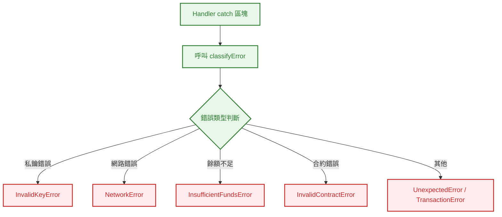
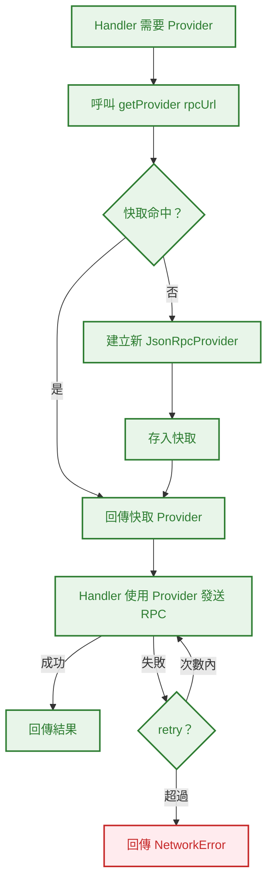
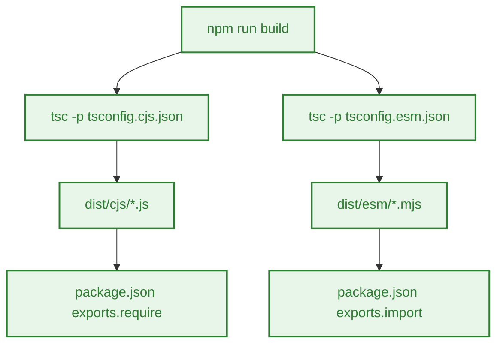
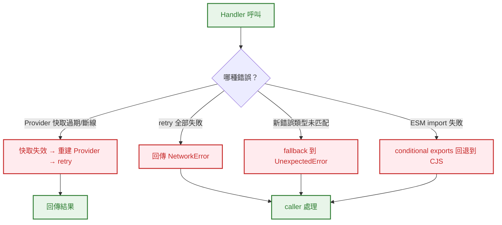

# S0 Brief Spec: architecture-refactor

> **階段**: S0 需求討論
> **建立時間**: 2026-03-14 15:00
> **Agent**: requirement-analyst
> **Spec Mode**: Full Spec
> **工作類型**: refactor

---

## 0. 工作類型

**本次工作類型**：`refactor`

## 1. 一句話描述

重構 openclaw-arbitrum-wallet 的內部架構：消除重複程式碼、集中錯誤分類、引入 Provider 管理層（含 retry/fallback）、並新增 ESM 雙格式輸出。

## 2. 為什麼要做

### 2.1 痛點

- **程式碼重複**：`classifyKeyError` 在 `sendTransaction.ts` 和 `signMessage.ts` 中完全相同，改一處忘改另一處就會產生分類不一致
- **錯誤分類散落**：4 個 handler 各自做 try/catch + string matching，新增錯誤類型需要改多處，容易遺漏
- **Provider 無重用**：每次 handler 呼叫都 `new JsonRpcProvider()`，無連線重用，效能浪費
- **無 retry/fallback**：單點 RPC 失敗直接回傳 NetworkError，agent runtime 體驗差
- **只支援 CJS**：`package.json` exports 沒有 ESM 入口，現代 Node.js/bundler 環境用 ESM import 會有問題

### 2.2 目標

- 消除所有重複程式碼，建立單一 error classification 模組
- 引入 Provider 管理層，支援連線重用與可配置的 retry/fallback
- 新增 ESM 輸出格式，CJS/ESM 雙格式並存
- **零行為變更**：所有 handler 的輸入/輸出介面與錯誤分類結果維持不變（v1.0 backward compatible）

## 3. 使用者

| 角色 | 說明 |
|------|------|
| openclaw agent runtime | 透過 require/import 呼叫 skill manifest 中的 tool handler |
| skill 開發者 | 維護與擴展此 package 的程式碼 |

## 4. 核心流程

### 4.0 功能區拆解（Functional Area Decomposition）

#### 功能區識別表

| FA ID | 功能區名稱 | 一句話描述 | 入口 | 獨立性 |
|-------|-----------|-----------|------|--------|
| FA-A | 錯誤分類集中化 | 抽取 `classifyKeyError` 及錯誤分類邏輯至 `src/errors.ts` | handler 內部 catch 區塊 | 中 |
| FA-B | Provider 管理層 | 建立 `src/provider.ts`，支援 Provider 快取、retry、multi-RPC fallback | `getBalance` / `sendTransaction` 的 RPC 呼叫 | 中 |
| FA-C | ESM 雙格式輸出 | 調整 tsconfig + package.json exports，產出 CJS + ESM 雙格式 dist | npm install / import | 高 |

**本次策略**：`single_sop_fa_labeled`

#### 跨功能區依賴

| 來源 FA | 目標 FA | 依賴類型 | 說明 |
|---------|---------|---------|------|
| FA-A | FA-B | 資料共用 | Provider 層的錯誤也需經過集中化的錯誤分類 |
| FA-C | FA-A, FA-B | 建置依賴 | ESM 輸出需要 FA-A/FA-B 的程式碼已重構完成 |

---

### 4.1 系統架構總覽

> 純後端 NPM package，無前端/DB。省略架構圖。

重構後模組結構：

```
src/
  ├── index.ts          # Skill manifest（不變）
  ├── types.ts          # 共用型別（不變）
  ├── errors.ts         # [新增] 集中錯誤分類
  ├── provider.ts       # [新增] Provider 管理層
  └── tools/
      ├── createWallet.ts   # 微調（使用 errors.ts）
      ├── getBalance.ts     # 重構（使用 errors.ts + provider.ts）
      ├── sendTransaction.ts # 重構（使用 errors.ts + provider.ts）
      └── signMessage.ts    # 重構（使用 errors.ts）
```

---

### 4.2 FA-A: 錯誤分類集中化

#### 4.2.1 全局流程圖



**技術細節**：
- `src/errors.ts` export `classifyKeyError(err)` + `classifyNetworkError(err)` + `classifyTransactionError(err)`
- 統一 error message 格式：`"{ErrorType}: {detail}"`
- 各 handler 的 catch 區塊改為呼叫集中函式

#### 4.2.N Happy Path 摘要

| 路徑 | 入口 | 結果 |
|------|------|------|
| A：錯誤分類 | handler catch → classifyError | 回傳標準化 `{ success: false, error: "{Type}: {msg}" }` |

---

### 4.3 FA-B: Provider 管理層

#### 4.3.1 全局流程圖



**技術細節**：
- `src/provider.ts` export `getProvider(rpcUrl?: string): JsonRpcProvider`
- 使用 `Map<string, JsonRpcProvider>` 做簡易快取（同一 rpcUrl 重用）
- retry 策略：最多 2 次重試（共 3 次嘗試），指數退避（200ms, 400ms）
- retry 僅適用於網路層錯誤（timeout、connection refused），非業務錯誤
- Provider 快取為 module-level 變數，skill 卸載時自動 GC

#### 4.3.N Happy Path 摘要

| 路徑 | 入口 | 結果 |
|------|------|------|
| A：Provider 快取命中 | getProvider("https://arb1...") | 直接回傳既有 Provider |
| B：Provider 快取未命中 | getProvider("https://custom...") | 建立新 Provider → 快取 → 回傳 |
| C：RPC retry 成功 | 第 1 次失敗 → 第 2 次成功 | 回傳結果，caller 無感 |

---

### 4.4 FA-C: ESM 雙格式輸出

#### 4.4.1 全局流程圖



**技術細節**：
- 兩套 tsconfig：`tsconfig.cjs.json`（module: commonjs）+ `tsconfig.esm.json`（module: es2020）
- `package.json` exports 使用 conditional exports：`"."` → `{ import, require, types }`
- build script 改為 `tsc -p tsconfig.cjs.json && tsc -p tsconfig.esm.json`
- ESM 輸出使用 `.mjs` 副檔名避免 `type: "module"` 的全域影響

---

### 4.5 例外流程圖



### 4.6 六維度例外清單

| 維度 | ID | FA | 情境 | 觸發條件 | 預期行為 | 嚴重度 |
|------|-----|-----|------|---------|---------|--------|
| 並行/競爭 | E1 | FA-B | 多個 handler 同時呼叫 getProvider | 並行 handler call | Provider 快取 Map 是同步存取，無 race condition（單執行緒 Node.js） | P2 |
| 狀態轉換 | E2 | FA-B | Provider 快取中的連線斷線 | RPC 節點重啟/網路中斷 | retry 機制處理；若 retry 失敗回傳 NetworkError | P1 |
| 資料邊界 | E3 | FA-A | 未知的 ethers error code | ethers 新版本新增的 error code | classifyError fallback 到 UnexpectedError/TransactionError | P2 |
| 網路/外部 | E4 | FA-B | RPC 節點完全不可達 | 網路斷線 / RPC 節點下線 | 3 次嘗試後回傳 NetworkError（含 retry 資訊） | P1 |
| 業務邏輯 | E5 | 全域 | 重構後錯誤分類結果不同 | 某個 edge case 的 string matching 改變 | **不可接受**——所有既有錯誤分類行為必須 100% 不變 | P0 |
| UI/體驗 | E6 | FA-C | ESM import 路徑錯誤 | 使用者用 `import` 但 exports 設定有誤 | conditional exports 正確指向 ESM 入口 | P1 |

### 4.7 白話文摘要

這次改造是內部整理，不改變任何外在行為。把重複的程式碼合併、讓網路呼叫更穩定（自動重試）、讓套件可以用新式 import 語法。最壞情況是重構過程中弄壞了錯誤分類，所以必須確保所有既有測試 100% 通過。

## 5. 成功標準

| # | FA | 類別 | 標準 | 驗證方式 |
|---|-----|------|------|---------|
| 1 | FA-A | 程式碼品質 | `classifyKeyError` 只存在於 `src/errors.ts`，不再有重複 | grep 驗證 |
| 2 | FA-A | 行為不變 | 所有既有 22 個測試 100% 通過，零修改 | `npm test` |
| 3 | FA-B | 功能 | 同一 rpcUrl 的 Provider 被重用（不重複建立） | 單元測試驗證 |
| 4 | FA-B | 功能 | 網路錯誤自動 retry 最多 2 次 | 單元測試驗證 |
| 5 | FA-B | 行為不變 | handler 的輸入/輸出格式完全不變 | 既有測試通過 |
| 6 | FA-C | 功能 | `import` 和 `require` 都能正確載入 manifest | 驗證腳本 |
| 7 | FA-C | 建置 | `npm run build` 產出 `dist/cjs/` 和 `dist/esm/` | build 驗證 |
| 8 | 全域 | 安全 | 無新增 console.log，無私鑰洩漏風險 | grep 驗證 |

## 6. 範圍

### 範圍內
- **FA-A**: 新增 `src/errors.ts`，集中所有錯誤分類邏輯
- **FA-A**: 重構 4 個 handler 的 catch 區塊使用集中函式
- **FA-B**: 新增 `src/provider.ts`，Provider 快取 + retry
- **FA-B**: 重構 `getBalance` / `sendTransaction` 使用 provider.ts
- **FA-C**: 新增 `tsconfig.cjs.json` + `tsconfig.esm.json`
- **FA-C**: 修改 `package.json` exports 為 conditional exports
- **FA-C**: 修改 build script

### 範圍外
- 新增任何 tool handler
- 修改 handler 的輸入/輸出介面
- 多鏈支援（Arbitrum Nova 等）
- RPC provider pool（多 URL 負載均衡）——本次僅做單 URL retry
- 版本號升至 2.0（維持 backward compatible）

## 7. 已知限制與約束

- Provider 快取為 module-level，無 TTL 或 LRU eviction（保持簡單）
- retry 僅針對網路層錯誤，業務錯誤（如 insufficient funds）不 retry
- ESM 輸出使用 `.mjs` 副檔名，需驗證 openclaw runtime 是否支援
- 版本號建議升至 `1.1.0`（minor bump，backward compatible）

## 8. 前端 UI 畫面清單

> 純後端 NPM package，無前端畫面。省略。

---

## 10. SDD Context

```json
{
  "sdd_context": {
    "stages": {
      "s0": {
        "status": "pending_confirmation",
        "agent": "requirement-analyst",
        "output": {
          "brief_spec_path": "dev/specs/architecture-refactor/s0_brief_spec.md",
          "work_type": "refactor",
          "requirement": "重構內部架構：消除重複程式碼、集中錯誤分類、引入 Provider 管理層（含 retry/fallback）、新增 ESM 雙格式輸出",
          "pain_points": [
            "classifyKeyError 重複定義在兩個檔案",
            "錯誤分類邏輯散落 4 個 handler",
            "Provider 每次呼叫重建無重用",
            "無 retry/fallback 機制",
            "只支援 CJS 無 ESM"
          ],
          "goal": "零行為變更的前提下，改善程式碼品質、網路穩定性、與模組格式相容性",
          "success_criteria": [
            "classifyKeyError 只存在 src/errors.ts",
            "既有 22 個測試 100% 通過",
            "Provider 快取重用驗證",
            "retry 機制驗證",
            "CJS + ESM 雙格式載入驗證"
          ],
          "scope_in": [
            "新增 src/errors.ts",
            "新增 src/provider.ts",
            "重構 4 個 handler catch 區塊",
            "ESM 雙格式 tsconfig + exports"
          ],
          "scope_out": [
            "新增 tool handler",
            "修改 handler 介面",
            "多鏈支援",
            "多 URL 負載均衡",
            "major version bump"
          ],
          "constraints": [
            "零行為變更",
            "backward compatible",
            "Provider 快取無 TTL/LRU",
            "retry 僅網路層"
          ],
          "functional_areas": [
            {"id": "FA-A", "name": "錯誤分類集中化", "description": "抽取並集中錯誤分類邏輯至 src/errors.ts", "independence": "medium"},
            {"id": "FA-B", "name": "Provider 管理層", "description": "Provider 快取 + retry/fallback", "independence": "medium"},
            {"id": "FA-C", "name": "ESM 雙格式輸出", "description": "CJS + ESM conditional exports", "independence": "high"}
          ],
          "decomposition_strategy": "single_sop_fa_labeled",
          "child_sops": []
        }
      }
    }
  }
}
```
