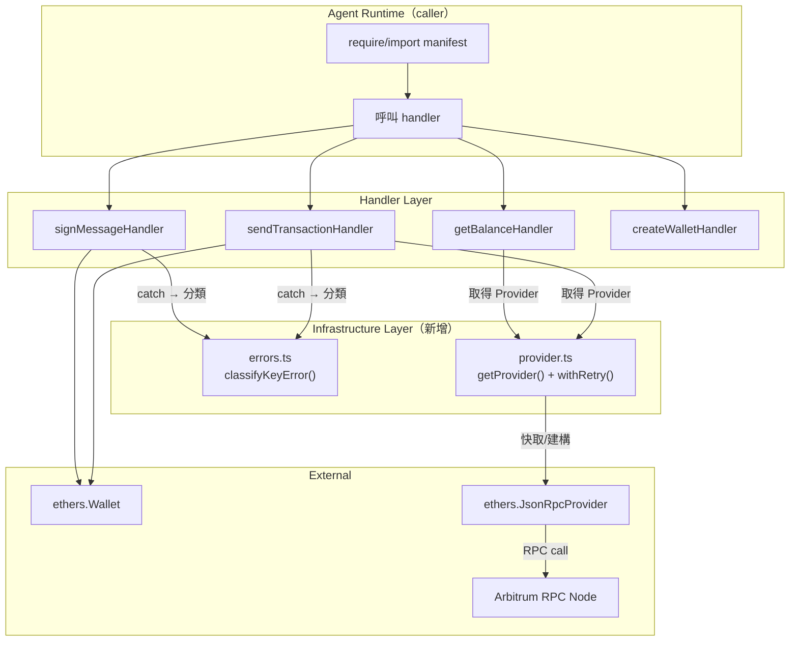
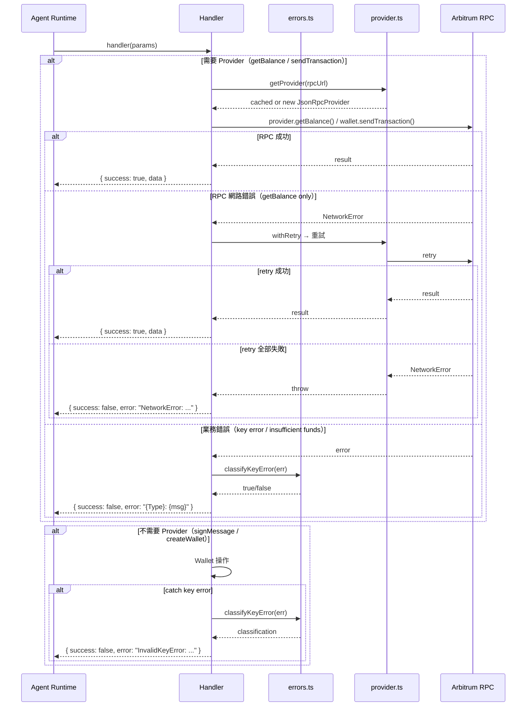

# S1 Dev Spec: architecture-refactor

> **階段**: S1 技術分析
> **建立時間**: 2026-03-15 10:00
> **Agent**: codebase-explorer (Phase 1) + architect (Phase 2)
> **工作類型**: refactor
> **複雜度**: M

---

## 1. 概述

### 1.1 需求參照
> 完整需求見 `s0_brief_spec.md`，以下僅摘要。

重構 openclaw-arbitrum-wallet 內部架構：消除 `classifyKeyError` 重複、集中錯誤分類、引入 Provider 快取 + retry、新增 ESM 雙格式輸出。零行為變更，22 個既有測試 100% 通過，版本 1.0.0 → 1.1.0。

### 1.2 技術方案摘要

新增兩個內部模組 `src/errors.ts` 和 `src/provider.ts`，重構四個 handler 的 import 來源，新增雙 tsconfig 產出 CJS + ESM 雙格式 dist。所有 handler 的公開介面（輸入參數、回傳格式、錯誤分類字串）完全不變。

---

## 2. 影響範圍（Phase 1：codebase-explorer）

### 2.1 受影響檔案

| 檔案 | 變更類型 | FA | 說明 |
|------|---------|-----|------|
| `src/errors.ts` | 新增 | FA-A | 集中錯誤分類函式 |
| `src/provider.ts` | 新增 | FA-B | Provider 快取 + retry wrapper |
| `src/tools/sendTransaction.ts` | 修改 | FA-A, FA-B | 移除 inline `classifyKeyError`，改用 `errors.ts`；`new JsonRpcProvider` 改用 `getProvider` |
| `src/tools/signMessage.ts` | 修改 | FA-A | 移除 inline `classifyKeyError`，改用 `errors.ts` |
| `src/tools/getBalance.ts` | 修改 | FA-B | `new JsonRpcProvider` 改用 `getProvider` |
| `src/tools/createWallet.ts` | 不動 | - | 無 RPC 呼叫、無 classifyKeyError，不需修改（S0 §4.1 標記「微調」為不精確描述，經驗證無需修改） |
| `src/index.ts` | 修改 | FA-C | manifest.version 同步更新為 1.1.0 |
| `src/types.ts` | 不動 | - | 型別不變 |
| `tsconfig.json` | 修改 | FA-C | 重命名或保留為 IDE 用，新增 tsconfig.cjs.json + tsconfig.esm.json |
| `tsconfig.cjs.json` | 新增 | FA-C | CJS 編譯設定 |
| `tsconfig.esm.json` | 新增 | FA-C | ESM 編譯設定 |
| `package.json` | 修改 | FA-C | exports conditional、build script、version bump |

### 2.2 依賴關係

- **上游依賴**: `ethers` v6（`JsonRpcProvider`, `Wallet`, `isAddress`, `parseEther` 等）
- **下游影響**: openclaw agent runtime（透過 `require`/`import` 載入 manifest）
- **內部新依賴**: `sendTransaction.ts` → `errors.ts` + `provider.ts`；`signMessage.ts` → `errors.ts`；`getBalance.ts` → `provider.ts`

### 2.3 現有模式與技術考量

- **Handler 模式**: 所有 handler 回傳 `HandlerResult<T>`，never throw。錯誤以 `{ success: false, error: "{Type}: {msg}" }` 格式回傳。
- **Mock 模式**: 測試使用 `jest.mock("ethers")` 做模組級 mock，攔截 `JsonRpcProvider`、`Wallet`、`Contract` 建構子。新模組的 import 路徑改變不影響 mock，因為 mock 對象是 `ethers` 而非內部模組。
- **錯誤分類**: 靠 `error.code` + `error.message` 字串比對做分類，ethers v6 的 error code 是自訂字串（如 `"INVALID_ARGUMENT"`、`"INSUFFICIENT_FUNDS"`、`"NETWORK_ERROR"`）。

---

## 2.5 [refactor 專用] 現狀分析

### 現狀問題

| # | 問題 | 嚴重度 | 影響範圍 | 說明 |
|---|------|--------|---------|------|
| 1 | `classifyKeyError` 重複定義 | 中 | sendTransaction.ts, signMessage.ts | 完全相同的 11 行程式碼複製貼上，改一處忘改另一處會造成分類不一致 |
| 2 | Provider 無重用 | 中 | getBalance.ts, sendTransaction.ts | 每次 handler 呼叫都 `new JsonRpcProvider()`，同一 rpcUrl 重複建構浪費資源 |
| 3 | 無 retry 機制 | 中 | getBalance.ts, sendTransaction.ts | RPC 暫時性網路錯誤直接回傳 NetworkError，agent runtime 體驗差 |
| 4 | 只支援 CJS | 低 | package.json, tsconfig.json | 現代 Node.js/bundler 環境用 ESM import 無法正確解析 |

### 目標狀態（Before → After）

| 面向 | Before | After |
|------|--------|-------|
| 錯誤分類 | `classifyKeyError` 分散在 2 個檔案（共 22 行重複） | 集中於 `src/errors.ts` 單一來源 |
| Provider 建構 | 每次呼叫 `new JsonRpcProvider(rpcUrl)`（2 處 inline） | `getProvider(rpcUrl)` 回傳快取實例 |
| 網路韌性 | 無 retry，第一次失敗即回傳 NetworkError | 網路錯誤自動 retry 最多 2 次（指數退避 200ms/400ms） |
| 模組格式 | 單一 CJS（`dist/*.js`） | CJS（`dist/cjs/*.js`）+ ESM（`dist/esm/*.js` + 目錄級 `package.json` `{"type":"module"}`）雙格式 |
| 版本 | 1.0.0 | 1.1.0（minor bump, backward compatible） |

### 遷移路徑

1. **FA-A 先行**：建立 `src/errors.ts`，將 `classifyKeyError` 搬入並 export。修改 `sendTransaction.ts` 和 `signMessage.ts` 改為 import。
2. **FA-B 接續**：建立 `src/provider.ts`，實作 `getProvider` + `withRetry` + `resetProviderCache`。修改 `getBalance.ts` 和 `sendTransaction.ts` 改用 `getProvider`。
3. **FA-C 最後**：新增雙 tsconfig，修改 package.json exports/build/version。
4. **驗證**：執行全部 22 個測試確認零失敗，手動驗證 CJS + ESM 雙格式載入。

### 回歸風險矩陣

| 外部行為 | 驗證方式 | 風險等級 |
|---------|---------|---------|
| InvalidKeyError 分類（5 個條件完整保留） | 既有測試 #4, #5（sendTransaction）+ #2（signMessage） | 🔴 高 |
| InsufficientFundsError 分類 | 既有測試 #6（sendTransaction） | 中 |
| NetworkError 分類 | 既有測試 #7（sendTransaction）+ #5（getBalance） | 中 |
| InvalidContractError 分類 | 既有測試 #7（getBalance） | 中 |
| ValidationError 分類 | 既有測試 #2-4（sendTransaction）+ #7-8（getBalance） | 低 |
| handler 回傳格式 `{ success, data?, error? }` | 全部 22 個測試 | 低 |
| `require("openclaw-arbitrum-wallet")` 仍可用 | 手動 CJS require 測試 | 中 |
| `import` 可用（新行為） | 手動 ESM import 測試 | 中 |

---

## 3. Module Interaction Flow（Phase 2：architect）

> 此為 NPM library，非 UI 應用。以模組互動流程取代 User Flow。



### 3.1 重構後的呼叫路徑

| 情境 | Before | After |
|------|--------|-------|
| sendTransaction 取得 Provider | `new JsonRpcProvider(rpcUrl)` inline | `getProvider(rpcUrl)` from provider.ts |
| getBalance 取得 Provider | `new JsonRpcProvider(rpcUrl)` inline | `getProvider(rpcUrl)` from provider.ts |
| sendTransaction catch key error | inline `classifyKeyError()` | import `{ classifyKeyError }` from errors.ts |
| signMessage catch key error | inline `classifyKeyError()` | import `{ classifyKeyError }` from errors.ts |
| getBalance RPC 呼叫 | 直接 `provider.getBalance()` | `withRetry(() => provider.getBalance())` |

### 3.2 例外流程

| S0 ID | 情境 | 觸發條件 | 系統處理 | 結果 |
|-------|------|---------|---------|------|
| E1 | 多 handler 並行呼叫 getProvider | 並行 handler call | Node.js 單執行緒，Map 同步存取無 race | 安全 |
| E2 | Provider 快取中的連線斷線 | RPC 節點重啟 | withRetry 捕獲網路錯誤並重試 | retry 成功或回傳 NetworkError |
| E3 | 未知 ethers error code | ethers 新版 | classifyKeyError 不匹配 → fallback 到 TransactionError/UnexpectedError | 既有行為不變 |
| E4 | RPC 完全不可達 | 網路斷線 | 3 次嘗試（1 + 2 retry）後回傳 NetworkError | 增加了韌性但最終仍失敗 |
| E5 | 重構後分類結果不同 | classifyKeyError 條件遺漏 | **P0 不可接受** — 5 個條件必須逐字保留 | 由既有測試守護 |

---

## 4. Data Flow



### 4.1 模組介面（取代 API 契約）

> 此為 NPM library，無 HTTP API。以模組 export 介面取代。

#### 「零行為變更」精確定義

- error type 前綴（`NetworkError:`、`InvalidKeyError:`、`ValidationError:` 等）**必須不變**
- error message 的 detail 部分（冒號後的文字）**允許因 retry 而有差異**（例如 retry 後 error message 可能包含 retry count）
- handler 回傳的 `{ success, data?, error? }` 結構**必須不變**
- `withRetry` **必須 rethrow 原始 error object**（不包裝、不修改），確保 handler 的 catch 區塊拿到的 error 與直接呼叫時完全相同

#### S0 Descope 記錄

S0 §4.2 提及集中三個分類函式（`classifyKeyError`、`classifyNetworkError`、`classifyTransactionError`）。經 codebase 驗證：
- `classifyKeyError`：重複定義於 2 個檔案 → **本次集中化**
- `InsufficientFundsError` / `NetworkError` 判定：僅存在於 `sendTransaction.ts` 一處，無重複 → **Descope**（ROI 低，無重複問題）
- 未來若新增 handler 需要這些分類，再擴展 `errors.ts`

**`src/errors.ts` 介面**

```typescript
/**
 * 判斷是否為私鑰相關錯誤。
 * 五個必保留條件（逐字不可更動）：
 * 1. error.code === "INVALID_ARGUMENT"
 * 2. msgLower.includes("invalid private key")
 * 3. msgLower.includes("invalid argument")
 * 4. msgLower.includes("valid bigint")
 * 5. msgLower.includes("curve.n")
 */
export function classifyKeyError(err: unknown): boolean;
```

**`src/provider.ts` 介面**

```typescript
/**
 * 取得快取的 JsonRpcProvider。同一 rpcUrl 回傳同一實例。
 * @param rpcUrl - RPC endpoint URL，預設 DEFAULT_RPC_URL
 */
export function getProvider(rpcUrl?: string): JsonRpcProvider;

/**
 * 清除 Provider 快取。供測試用。
 */
export function resetProviderCache(): void;

/**
 * Retry wrapper。網路錯誤時自動重試，業務錯誤直接 rethrow。
 * @param fn - 要執行的非同步函式
 * @param options - { maxRetries: 2, baseDelay: 200, isRetryable?: (err) => boolean }
 */
export function withRetry<T>(
  fn: () => Promise<T>,
  options?: RetryOptions
): Promise<T>;

interface RetryOptions {
  maxRetries?: number;    // 預設 2
  baseDelay?: number;     // 預設 200 (ms)，指數退避：200, 400
  delayFn?: (ms: number) => Promise<void>;  // 可注入，測試用 fake timer
  isRetryable?: (err: unknown) => boolean;  // 預設：僅 network/timeout/connection
}
```

### 4.2 classifyKeyError 五個條件（完整逐字記錄）

此為本次重構的 **P0 關鍵不變式**。以下五個條件必須完全保留，順序與邏輯不得更動：

```typescript
function classifyKeyError(err: unknown): boolean {
  const code = (err as { code?: string }).code;
  const msg = err instanceof Error ? err.message : String(err);
  const msgLower = msg.toLowerCase();
  return (
    code === "INVALID_ARGUMENT" ||              // 條件 1
    msgLower.includes("invalid private key") || // 條件 2
    msgLower.includes("invalid argument") ||    // 條件 3
    msgLower.includes("valid bigint") ||        // 條件 4
    msgLower.includes("curve.n")                // 條件 5
  );
}
```

**來源驗證**：
- `src/tools/sendTransaction.ts` L9-20：完全匹配以上五個條件
- `src/tools/signMessage.ts` L4-15：完全匹配以上五個條件
- 被呼叫 3 處：sendTransaction Wallet 建構 catch (L58)、sendTransaction 廣播 catch (L91)、signMessage Wallet 建構 catch (L27)

---

## 5. 任務清單

### 5.1 任務總覽

| # | 任務 | FA | 類型 | 複雜度 | Agent | 依賴 |
|---|------|----|------|--------|-------|------|
| T1 | 建立 `src/errors.ts` | FA-A | 後端 | S | ts-expert | - |
| T2 | 重構 handlers 使用 errors.ts | FA-A | 後端 | S | ts-expert | T1 |
| T3 | 建立 `src/provider.ts` | FA-B | 後端 | M | ts-expert | - |
| T4 | 重構 handlers 使用 provider.ts | FA-B | 後端 | S | ts-expert | T2, T3 |
| T5 | 雙 tsconfig + package.json 更新 | FA-C | 後端 | M | ts-expert | - |
| T6 | 整合驗證 | 全域 | 測試 | S | ts-expert | T1-T5 |

### 5.2 任務詳情

#### Task T1: 建立 `src/errors.ts` [FA-A]
- **類型**: 後端
- **複雜度**: S
- **Agent**: ts-expert
- **描述**: 新增 `src/errors.ts`，從 `sendTransaction.ts` 搬移 `classifyKeyError` 函式並 export。函式簽名、內部邏輯、五個條件必須逐字保留。
- **DoD**:
  - [ ] `src/errors.ts` 已建立
  - [ ] `classifyKeyError(err: unknown): boolean` 已 export
  - [ ] 五個條件與原始碼逐字一致（INVALID_ARGUMENT、invalid private key、invalid argument、valid bigint、curve.n）
  - [ ] TypeScript 編譯通過
- **驗收方式**: diff 比對原始 classifyKeyError 與新版，確認邏輯完全一致

#### Task T2: 重構 handlers 使用 errors.ts [FA-A]
- **類型**: 後端
- **複雜度**: S
- **Agent**: ts-expert
- **依賴**: T1
- **描述**: 修改 `sendTransaction.ts` 和 `signMessage.ts`，刪除 inline `classifyKeyError`，改為 `import { classifyKeyError } from "../errors"`。其他邏輯不動。
- **DoD**:
  - [ ] `sendTransaction.ts` 不再有 inline `classifyKeyError` 定義
  - [ ] `signMessage.ts` 不再有 inline `classifyKeyError` 定義
  - [ ] 兩個檔案的 import 指向 `../errors`
  - [ ] `grep -r "function classifyKeyError" src/` 只在 `errors.ts` 出現
  - [ ] 全部 22 個測試通過
- **驗收方式**: `npm test` 全部通過 + grep 驗證無重複

#### Task T3: 建立 `src/provider.ts` [FA-B]
- **類型**: 後端
- **複雜度**: M
- **Agent**: ts-expert
- **描述**: 新增 `src/provider.ts`，實作三個函式：
  1. `getProvider(rpcUrl?)` — module-level `Map<string, JsonRpcProvider>` 快取，同一 URL 回傳同一實例
  2. `resetProviderCache()` — 清空快取 Map，供測試用
  3. `withRetry<T>(fn, options?)` — 通用 retry wrapper，預設最多 2 次重試、指數退避 200ms/400ms，僅 retry 網路錯誤

  **Retry 可重試判定邏輯**（`isRetryable` 預設實作）：
  ```
  code === "NETWORK_ERROR" ||
  msgLower.includes("network") ||
  msgLower.includes("timeout") ||
  msgLower.includes("connection") ||
  msgLower.includes("econnrefused") ||
  msgLower.includes("econnreset")
  ```

  **delay 可注入**：`options.delayFn` 預設為 `(ms) => new Promise(r => setTimeout(r, ms))`，測試時可替換為 fake timer 避免真實等待。
- **DoD**:
  - [ ] `src/provider.ts` 已建立
  - [ ] `getProvider(rpcUrl?)` export 且使用 Map 快取
  - [ ] `resetProviderCache()` export 且清空 Map
  - [ ] `withRetry(fn, opts?)` export 且實作指數退避
  - [ ] `withRetry` 對非網路錯誤直接 rethrow（不 retry）
  - [ ] `delayFn` 可注入
  - [ ] TypeScript 編譯通過
- **驗收方式**: 單元測試驗證快取命中、retry 行為、非網路錯誤不 retry

#### Task T4: 重構 handlers 使用 provider.ts [FA-B]
- **類型**: 後端
- **複雜度**: S
- **Agent**: ts-expert
- **依賴**: T2, T3
- **描述**:
  1. `getBalance.ts`：`new JsonRpcProvider(...)` 改為 `getProvider(rpcUrl)`。ETH getBalance 和 ERC20 balanceOf 呼叫包 `withRetry`（讀取操作，安全 retry）。
  2. `sendTransaction.ts`：`new JsonRpcProvider(...)` 改為 `getProvider(rpcUrl)`。**`wallet.sendTransaction()` 不包 withRetry**（狀態變更操作，retry 會導致重複廣播）。

  **關鍵設計決策**：`withRetry` 僅用在 read-only RPC 呼叫（getBalance、balanceOf、decimals、symbol）。sendTransaction 的廣播是 fire-and-forget，絕對不 retry。
- **DoD**:
  - [ ] `getBalance.ts` 不再有 `new JsonRpcProvider`，改用 `getProvider`
  - [ ] `sendTransaction.ts` 不再有 `new JsonRpcProvider`，改用 `getProvider`
  - [ ] `getBalance.ts` 的 `provider.getBalance()` 和 ERC20 呼叫包了 `withRetry`
  - [ ] `sendTransaction.ts` 的 `wallet.sendTransaction()` **沒有**包 `withRetry`
  - [ ] `grep -r "new JsonRpcProvider" src/` 無結果
  - [ ] 全部 22 個測試通過
- **驗收方式**: `npm test` 全部通過 + grep 驗證

#### Task T5: 雙 tsconfig + package.json 更新 [FA-C]
- **類型**: 後端
- **複雜度**: M
- **Agent**: ts-expert
- **描述**:
  1. 建立 `tsconfig.cjs.json`：繼承或獨立，`module: "commonjs"`, `outDir: "./dist/cjs"`
  2. 建立 `tsconfig.esm.json`：`module: "ES2020"`, `outDir: "./dist/esm"`
  3. 保留 `tsconfig.json` 供 IDE / Jest 使用（指向 src，不變）
  4. **建立 `dist/esm/package.json`**：只含 `{"type": "module"}`，讓 `.js` 檔案在 dist/esm/ 下被 Node.js 視為 ESM（取代 .mjs rename 策略，避免 import specifier 不匹配問題）
  5. 修改 `package.json`：
     - `"main": "./dist/cjs/index.js"`
     - `"types": "./dist/cjs/index.d.ts"`
     - `"exports": { ".": { "types": "./dist/cjs/index.d.ts", "import": "./dist/esm/index.js", "require": "./dist/cjs/index.js" } }`
     - `"build": "rm -rf dist && tsc -p tsconfig.cjs.json && tsc -p tsconfig.esm.json && echo '{\"type\":\"module\"}' > dist/esm/package.json"`
     - `"version": "1.1.0"`
  6. 修改 `src/index.ts`：manifest.version 同步更新為 `"1.1.0"`
  7. **exports 條件順序**：`types` 必須在第一位（TypeScript 規範），然後 `import`，最後 `require`。

  **ESM 策略**（S2 SR-009 修正）：放棄 `.mjs` rename，改用 `dist/esm/package.json` + `{"type": "module"}`。tsc 編譯出的 import specifier 保持 `.js`，在 `"type": "module"` 的目錄下 Node.js 會正確解析為 ESM。
- **DoD**:
  - [ ] `tsconfig.cjs.json` 存在且 `tsc -p tsconfig.cjs.json` 成功產出 `dist/cjs/`
  - [ ] `tsconfig.esm.json` 存在且產出 `dist/esm/` 含 `.js` 檔案
  - [ ] `dist/esm/package.json` 存在且含 `{"type": "module"}`
  - [ ] `tsconfig.json` 保留不變（IDE/Jest 用）
  - [ ] `package.json` version = "1.1.0"
  - [ ] `src/index.ts` manifest.version = "1.1.0"
  - [ ] `package.json` exports 含 types/import/require 三個條件（types 第一位）
  - [ ] build script 含 `rm -rf dist` 清理步驟
  - [ ] `npm run build` 成功產出雙格式
- **驗收方式**: `npm run build` 成功 + 檢查 dist/ 結構

#### Task T6: 整合驗證 [全域]
- **類型**: 測試
- **複雜度**: S
- **Agent**: ts-expert
- **依賴**: T1-T5
- **描述**: 執行全面驗證：
  1. `npm test` — 22 個測試 100% 通過（零修改）
  2. `npm run build` — 雙格式產出
  3. CJS 驗證：`node -e "const m = require('./dist/cjs/index.js'); console.log(m.default.name);"` → 輸出 `arbitrum-wallet`
  4. ESM 驗證：`node --input-type=module -e "import m from './dist/esm/index.js'; console.log(m.name);"` → 輸出 `arbitrum-wallet`
  5. `grep -r "function classifyKeyError" src/` — 只在 `errors.ts` 出現
  6. `grep -r "new JsonRpcProvider" src/` — 無結果
  7. 無新增 `console.log`
- **DoD**:
  - [ ] 22 個測試全部通過
  - [ ] CJS require 成功載入 manifest
  - [ ] ESM import 成功載入 manifest
  - [ ] 無程式碼重複（classifyKeyError 單一來源）
  - [ ] 無 inline Provider 建構
- **驗收方式**: 以上 7 項檢查全部通過

---

## 6. 技術決策

### 6.1 架構決策

| 決策點 | 選項 | 選擇 | 理由 |
|--------|------|------|------|
| U1: retry 層級 | A: handler 層 / B: provider 層 RPC call wrapper | B | handler 層 retry 會導致 sendTransaction fire-and-forget 重複廣播。RPC call wrapper 讓 caller 自行決定哪些 call 需要 retry |
| U2: fallback RPC URL | A: 支援多 URL pool / B: 僅同一 URL retry | B | 範圍外。多 URL 需要 health check、failover 邏輯，過度設計。本次只做同一 URL 的 retry |
| retry 對象 | A: 所有 RPC call / B: 僅 read-only call | B | sendTransaction broadcast 是狀態變更，retry 可能導致 nonce 衝突或重複廣播。只有 getBalance 等讀取操作 wrap withRetry |
| ESM 策略 | A: .mjs rename / B: dist/esm/package.json + type:"module" | B | .mjs rename 導致 import specifier 不匹配（SR-009）。`dist/esm/package.json` 只影響該子目錄，不影響根目錄的 Jest（CJS）和現有 require |
| tsconfig 策略 | A: 保留原 tsconfig + 新增兩個 / B: 刪除原 tsconfig | A | 保留 `tsconfig.json` 供 IDE IntelliSense 和 Jest ts-jest 使用。兩個新的 tsconfig 只供 build 用 |
| exports 條件順序 | A: import → require → types / B: types → import → require | B | TypeScript 文件明確要求 `"types"` 條件放第一位，否則型別解析可能失敗 |

### 6.2 設計模式

- **Module-level Cache (Singleton per URL)**: `provider.ts` 使用 `Map<string, JsonRpcProvider>` 做 module-level 快取。ethers v6 的 `JsonRpcProvider` 是同步惰性建構（constructor 不發 HTTP），快取安全。
- **Strategy Pattern (Retry)**: `withRetry` 的 `isRetryable` 和 `delayFn` 可注入，caller 可自訂判定邏輯和延遲行為。測試時注入 fake delay 避免真實等待。

### 6.3 相容性考量

- **向後相容**: 所有 public API（handler 函式簽名、manifest 結構、錯誤字串格式）完全不變。`require("openclaw-arbitrum-wallet")` 行為不變。
- **Migration**: 無資料遷移。NPM consumers 升級 1.0.0 → 1.1.0 無需任何程式碼修改。
- **Jest 相容**: `jest.mock("ethers")` 攔截的是 ethers 模組，不受內部 import 路徑變更影響。`provider.ts` 的 Map cache 需要 `resetProviderCache()` 配合 `jest.clearAllMocks()` 防止測試間殘留，但既有測試不需修改（因為 mock 了整個 JsonRpcProvider constructor）。

---

## 7. 驗收標準

### 7.1 功能驗收

| # | 場景 | Given | When | Then | 優先級 | FA |
|---|------|-------|------|------|--------|-----|
| AC-1 | classifyKeyError 單一來源 | 重構完成 | `grep -r "function classifyKeyError" src/` | 只在 `errors.ts` 出現 1 次 | P0 | FA-A |
| AC-2 | 既有測試全數通過 | 重構完成 | `npm test` | 22 tests passed, 0 failures | P0 | 全域 |
| AC-3 | classifyKeyError 五條件保留 | `errors.ts` 存在 | 檢查 classifyKeyError 實作 | 包含 INVALID_ARGUMENT / invalid private key / invalid argument / valid bigint / curve.n 五個條件 | P0 | FA-A |
| AC-4 | Provider 快取重用 | 同一 rpcUrl 呼叫兩次 getProvider | 比較回傳值 | 回傳同一 Provider 實例（`===` 為 true） | P0 | FA-B |
| AC-5 | withRetry 網路錯誤重試 | fn 第一次 throw NetworkError | withRetry(fn) | fn 被呼叫 2+ 次，最終成功或失敗 | P1 | FA-B |
| AC-6 | withRetry 業務錯誤不重試 | fn throw INSUFFICIENT_FUNDS | withRetry(fn) | fn 只被呼叫 1 次，立即 rethrow | P1 | FA-B |
| AC-7 | sendTransaction 不 retry 廣播 | sendTransaction handler | wallet.sendTransaction() 失敗 | 不經過 withRetry，直接分類回傳 | P0 | FA-B |
| AC-8 | CJS require 成功 | `npm run build` 完成 | `require("./dist/cjs/index.js")` | 載入 manifest，manifest.name === "arbitrum-wallet" | P0 | FA-C |
| AC-9 | ESM import 成功 | `npm run build` 完成 | `import ... from "./dist/esm/index.js"` | 載入 manifest，manifest.name === "arbitrum-wallet" | P0 | FA-C |
| AC-10 | 版本號更新 | package.json | 檢查 version 欄位 | "1.1.0" | P1 | FA-C |

### 7.2 非功能驗收

| 項目 | 標準 |
|------|------|
| 行為不變 | 所有 handler 的錯誤分類結果、回傳格式完全不變 |
| 無安全風險 | 無 console.log、無私鑰洩漏、無 secrets commit |
| 程式碼品質 | 無重複程式碼（classifyKeyError 單一來源、Provider 建構單一來源） |

### 7.3 測試計畫

- **既有測試（不修改）**: 4 個 test file、22 個 test case 全部通過
- **新增單元測試（必須，S4 階段加入）**:
  - `tests/errors.test.ts`: classifyKeyError 五個條件各自驗證 + 非 key error 回傳 false（守護 AC-3）
  - `tests/provider.test.ts`: getProvider 快取命中（AC-4）、resetProviderCache 清空、withRetry 網路錯誤重試（AC-5）、業務錯誤不 retry（AC-6）、withRetry rethrow 原始 error object
- **整合驗證**: CJS require + ESM import 手動驗證腳本

---

## 8. 風險與緩解

| 風險 | 影響 | 機率 | 緩解措施 | FA |
|------|------|------|---------|-----|
| classifyKeyError 五條件遺漏 | 🔴 高（錯誤分類行為改變） | 低 | 逐字從原始碼複製；既有測試覆蓋 3/5 條件；AC-3 強制檢查 | FA-A |
| withRetry delay 導致測試超時 | 🟡 中（CI 失敗） | 中 | `delayFn` 可注入；測試使用 `delayFn: () => Promise.resolve()` 跳過真實延遲 | FA-B |
| Provider cache 殘留污染 Jest 測試 | 🟡 中（測試不穩定） | 中 | 既有測試 mock 了整個 `JsonRpcProvider` constructor，cache Map 中存的是 mock 實例，`jest.clearAllMocks()` + module re-import 足夠。若有問題可在 `afterEach` 呼叫 `resetProviderCache()` | FA-B |
| exports 條件順序錯誤 | 🟡 中（型別解析失敗） | 低 | `types` 條件放第一位；T6 驗證 CJS + ESM 雙載入 | FA-C |
| dist/esm/package.json 遺漏 | 🟡 中（ESM import 失敗） | 低 | build script 自動產生 `dist/esm/package.json`，T6 驗證 ESM import 成功 | FA-C |
| sendTransaction retry 導致重複廣播 | 🔴 高（資金損失） | 極低 | 設計明確規定 `wallet.sendTransaction()` 不包 withRetry；AC-7 強制驗證 | FA-B |

### 回歸風險

- **P0**: classifyKeyError 行為不變 — 由 AC-2（22 tests pass）+ AC-3（五條件檢查）守護
- **P0**: handler 回傳格式不變 — 由 AC-2 守護
- **P1**: CJS require 路徑改變 — `package.json` main 從 `./dist/index.js` 改為 `./dist/cjs/index.js`，既有 consumer 若直接 `require("openclaw-arbitrum-wallet")` 會走 exports 條件而非 main，但 `main` 仍需正確指向 CJS 入口作為 fallback

---

## SDD Context

```json
{
  "sdd_context": {
    "stages": {
      "s1": {
        "status": "completed",
        "agents": ["codebase-explorer", "architect"],
        "completed_at": "2026-03-15T10:00:00Z",
        "output": {
          "completed_phases": [1, 2],
          "dev_spec_path": "dev/specs/architecture-refactor/s1_dev_spec.md",
          "impact_scope": {
            "new_files": ["src/errors.ts", "src/provider.ts", "tsconfig.cjs.json", "tsconfig.esm.json"],
            "modified_files": ["src/tools/sendTransaction.ts", "src/tools/signMessage.ts", "src/tools/getBalance.ts", "package.json", "tsconfig.json"],
            "unchanged_files": ["src/tools/createWallet.ts", "src/index.ts", "src/types.ts"]
          },
          "tasks": ["T1:errors.ts", "T2:refactor-handlers-errors", "T3:provider.ts", "T4:refactor-handlers-provider", "T5:dual-tsconfig-esm", "T6:integration-verify"],
          "acceptance_criteria": ["AC-1:single-source-classifyKeyError", "AC-2:22-tests-pass", "AC-3:5-conditions-preserved", "AC-4:provider-cache", "AC-5:retry-network", "AC-6:no-retry-business", "AC-7:no-retry-sendTx", "AC-8:cjs-require", "AC-9:esm-import", "AC-10:version-1.1.0"],
          "assumptions": [
            "ethers v6 JsonRpcProvider 同步惰性建構，快取安全",
            "jest.mock('ethers') 模組級攔截不受內部 import 路徑變更影響",
            "Node.js 單執行緒，Map 同步存取無 race condition"
          ],
          "solution_summary": "新增 errors.ts（集中 classifyKeyError）+ provider.ts（Provider 快取 + withRetry）+ 雙 tsconfig（CJS+ESM），零行為變更",
          "tech_debt": [],
          "regression_risks": ["classifyKeyError 五條件遺漏", "Provider cache 測試殘留", "exports 條件順序", "sendTransaction retry 重複廣播"]
        }
      }
    }
  }
}
```
