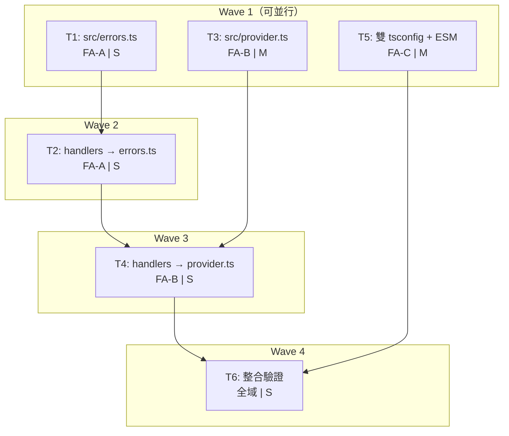

# S3 Implementation Plan: architecture-refactor

> **階段**: S3 實作計畫
> **建立時間**: 2026-03-15 13:00
> **Agent**: architect
> **工作類型**: refactor

---

## 1. 概述

### 1.1 功能目標

重構 openclaw-arbitrum-wallet 內部架構：消除 `classifyKeyError` 重複、集中錯誤分類至 `src/errors.ts`、引入 Provider 快取 + retry（`src/provider.ts`）、新增 CJS + ESM 雙格式輸出。零行為變更，22 個既有測試 100% 通過，版本 1.0.0 → 1.1.0。

### 1.2 實作範圍

- **範圍內**: 新增 `src/errors.ts`、`src/provider.ts`；重構 handler catch/provider 呼叫；雙 tsconfig + conditional exports；新增 `tests/errors.test.ts`、`tests/provider.test.ts`
- **範圍外**: 新增 tool handler、修改 handler 介面、多鏈支援、多 URL 負載均衡、major version bump

### 1.3 關聯文件

| 文件 | 路徑 | 狀態 |
|------|------|------|
| Brief Spec | `./s0_brief_spec.md` | completed |
| Dev Spec | `./s1_dev_spec.md` | completed (S2 修正後) |
| Review Report | `./s2_review_report.md` | completed |
| Implementation Plan | `./s3_implementation_plan.md` | 當前 |

### 1.4 S2 關鍵修正（實作必遵守）

1. **ESM 策略**: `dist/esm/package.json` + `{"type":"module"}`（不是 `.mjs` rename）
2. **新增測試是「必須」** 不是「建議」（`tests/errors.test.ts` + `tests/provider.test.ts`）
3. **build script 含 `rm -rf dist`** 清理步驟
4. **manifest.version 同步更新**（`src/index.ts` 中的 version 也要改為 `"1.1.0"`）
5. **exports 順序**: `types` → `import` → `require`
6. **withRetry 必須 rethrow 原始 error object**（不包裝、不修改）

---

## 2. 實作任務清單

### 2.1 任務總覽

| # | 任務 | FA | 類型 | Agent | 依賴 | 複雜度 | TDD | 狀態 |
|---|------|----|------|-------|------|--------|-----|------|
| T1 | 建立 `src/errors.ts` | FA-A | 後端 | `ts-expert` | - | S | yes | pending |
| T2 | 重構 handlers 使用 errors.ts | FA-A | 後端 | `ts-expert` | T1 | S | null | pending |
| T3 | 建立 `src/provider.ts` | FA-B | 後端 | `ts-expert` | - | M | yes | pending |
| T4 | 重構 handlers 使用 provider.ts | FA-B | 後端 | `ts-expert` | T2, T3 | S | null | pending |
| T5 | 雙 tsconfig + package.json + ESM | FA-C | 後端 | `ts-expert` | - | M | null | pending |
| T6 | 整合驗證 | 全域 | 測試 | `ts-expert` | T1-T5 | S | null | pending |

**狀態圖例**: pending / in_progress / completed / blocked / skipped

**複雜度**: S（<30min）/ M（30min-2hr）

**TDD**: `yes` = 有 tdd_plan, `null` = N/A（附 skip_justification）

---

## 3. 任務詳情

### Task T1: 建立 `src/errors.ts` [FA-A]

**基本資訊**

| 項目 | 內容 |
|------|------|
| 類型 | 後端 |
| Agent | `ts-expert` |
| 複雜度 | S |
| 依賴 | - |
| source_ref | - |
| 狀態 | pending |

**描述**

新增 `src/errors.ts`，從 `src/tools/sendTransaction.ts`（L9-20）逐字搬移 `classifyKeyError` 函式並 export。五個條件必須完全保留，順序與邏輯不得更動。

**輸入**
- `src/tools/sendTransaction.ts` L9-20 的 `classifyKeyError` 原始碼

**輸出**
- `src/errors.ts` 含 `export function classifyKeyError(err: unknown): boolean`
- `tests/errors.test.ts` 含 6 個測試案例

**受影響檔案**

| 檔案 | 變更類型 | 說明 |
|------|---------|------|
| `src/errors.ts` | 新增 | 集中錯誤分類函式 |
| `tests/errors.test.ts` | 新增 | classifyKeyError 單元測試 |

**DoD**
- [ ] `src/errors.ts` 已建立
- [ ] `classifyKeyError(err: unknown): boolean` 已 export
- [ ] 五個條件與原始碼逐字一致（INVALID_ARGUMENT、invalid private key、invalid argument、valid bigint、curve.n）
- [ ] TypeScript 編譯通過
- [ ] `tests/errors.test.ts` 6 個測試全部通過

**TDD Plan**

| 項目 | 內容 |
|------|------|
| 測試檔案 | `tests/errors.test.ts` |
| 測試指令 | `npx jest tests/errors.test.ts` |
| 測試案例 | `classifyKeyError — returns true for error.code === "INVALID_ARGUMENT"` |
| | `classifyKeyError — returns true for "invalid private key" in message` |
| | `classifyKeyError — returns true for "invalid argument" in message` |
| | `classifyKeyError — returns true for "valid bigint" in message` |
| | `classifyKeyError — returns true for "curve.n" in message` |
| | `classifyKeyError — returns false for non-key error` |

**驗證方式**
```bash
npx jest tests/errors.test.ts
grep -r "function classifyKeyError" src/
# 預期：只在 src/errors.ts 出現
```

**實作備註**
- 從 `sendTransaction.ts` L9-20 逐字複製，不做任何「改善」
- 先寫測試（TDD），再搬移函式
- P0 不變式：五個條件的順序、邏輯完全不動

---

### Task T2: 重構 handlers 使用 errors.ts [FA-A]

**基本資訊**

| 項目 | 內容 |
|------|------|
| 類型 | 後端 |
| Agent | `ts-expert` |
| 複雜度 | S |
| 依賴 | T1 |
| source_ref | - |
| 狀態 | pending |

**描述**

修改 `sendTransaction.ts` 和 `signMessage.ts`：
1. 刪除各自的 inline `classifyKeyError` 函式定義
2. 新增 `import { classifyKeyError } from "../errors"`
3. 其他邏輯完全不動

**輸入**
- T1 完成的 `src/errors.ts`

**輸出**
- `sendTransaction.ts` 和 `signMessage.ts` 改為 import `classifyKeyError`

**受影響檔案**

| 檔案 | 變更類型 | 說明 |
|------|---------|------|
| `src/tools/sendTransaction.ts` | 修改 | 移除 inline classifyKeyError，改用 import |
| `src/tools/signMessage.ts` | 修改 | 移除 inline classifyKeyError，改用 import |

**DoD**
- [ ] `sendTransaction.ts` 不再有 inline `classifyKeyError` 定義
- [ ] `signMessage.ts` 不再有 inline `classifyKeyError` 定義
- [ ] 兩個檔案的 import 指向 `../errors`
- [ ] `grep -r "function classifyKeyError" src/` 只在 `errors.ts` 出現
- [ ] 全部 22 個既有測試通過（零修改測試檔案）

**TDD Plan**: N/A — 驗證靠既有 22 個測試不壞。此任務是純 import 來源替換，無新邏輯。

**驗證方式**
```bash
npm test
grep -r "function classifyKeyError" src/
# 預期：只在 src/errors.ts 出現 1 次
```

**實作備註**
- 只改 import + 刪除 inline 函式定義，不碰其他任何程式碼
- 22 個測試必須零修改全部通過

---

### Task T3: 建立 `src/provider.ts` [FA-B]

**基本資訊**

| 項目 | 內容 |
|------|------|
| 類型 | 後端 |
| Agent | `ts-expert` |
| 複雜度 | M |
| 依賴 | - |
| source_ref | - |
| 狀態 | pending |

**描述**

新增 `src/provider.ts`，實作三個函式：

1. **`getProvider(rpcUrl?)`**: module-level `Map<string, JsonRpcProvider>` 快取，同一 URL 回傳同一實例。預設 URL 為 `"https://arb1.arbitrum.io/rpc"`。
2. **`resetProviderCache()`**: 清空快取 Map，供測試用。
3. **`withRetry<T>(fn, options?)`**: 通用 retry wrapper。預設最多 2 次重試（共 3 次嘗試），指數退避 200ms/400ms。僅 retry 網路錯誤（`isRetryable` 預設判定）。**必須 rethrow 原始 error object**（不包裝、不修改）。

`isRetryable` 預設判定邏輯：
```
code === "NETWORK_ERROR" ||
msgLower.includes("network") ||
msgLower.includes("timeout") ||
msgLower.includes("connection") ||
msgLower.includes("econnrefused") ||
msgLower.includes("econnreset")
```

`delayFn` 可注入，預設 `(ms) => new Promise(r => setTimeout(r, ms))`，測試時替換為 `() => Promise.resolve()`。

**輸入**
- 無前置依賴

**輸出**
- `src/provider.ts` 含 3 個 export 函式
- `tests/provider.test.ts` 含完整測試

**受影響檔案**

| 檔案 | 變更類型 | 說明 |
|------|---------|------|
| `src/provider.ts` | 新增 | Provider 快取 + retry wrapper |
| `tests/provider.test.ts` | 新增 | provider 模組單元測試 |

**DoD**
- [ ] `src/provider.ts` 已建立
- [ ] `getProvider(rpcUrl?)` export 且使用 Map 快取
- [ ] `resetProviderCache()` export 且清空 Map
- [ ] `withRetry(fn, opts?)` export 且實作指數退避
- [ ] `withRetry` 對非網路錯誤直接 rethrow 原始 error object（不 retry）
- [ ] `delayFn` 可注入
- [ ] TypeScript 編譯通過
- [ ] `tests/provider.test.ts` 全部通過

**TDD Plan**

| 項目 | 內容 |
|------|------|
| 測試檔案 | `tests/provider.test.ts` |
| 測試指令 | `npx jest tests/provider.test.ts` |
| 測試案例 | `getProvider — returns cached instance for same rpcUrl` |
| | `getProvider — returns different instance for different rpcUrl` |
| | `getProvider — uses default rpcUrl when none provided` |
| | `resetProviderCache — clears cached providers` |
| | `withRetry — returns result on first success` |
| | `withRetry — retries on network error and succeeds` |
| | `withRetry — throws after max retries exhausted` |
| | `withRetry — does not retry non-retryable errors` |
| | `withRetry — rethrows original error object (not wrapped)` |
| | `withRetry — respects custom isRetryable` |

**驗證方式**
```bash
npx jest tests/provider.test.ts
```

**實作備註**
- 先寫測試（TDD），再寫實作
- `withRetry` rethrow 原始 error 是 P0 不變式（S2 SR-004 修正），handler 的 catch 區塊必須拿到與直接呼叫完全相同的 error
- 測試中的 `delayFn` 注入 `() => Promise.resolve()` 避免真實等待
- `jest.mock("ethers")` 需要 mock `JsonRpcProvider` constructor

---

### Task T4: 重構 handlers 使用 provider.ts [FA-B]

**基本資訊**

| 項目 | 內容 |
|------|------|
| 類型 | 後端 |
| Agent | `ts-expert` |
| 複雜度 | S |
| 依賴 | T2, T3 |
| source_ref | - |
| 狀態 | pending |

**描述**

1. **`getBalance.ts`**: `new JsonRpcProvider(...)` 改為 `getProvider(rpcUrl)`。ETH `provider.getBalance()` 和 ERC20 `contract.balanceOf()` / `contract.decimals()` / `contract.symbol()` 呼叫包 `withRetry`（讀取操作，安全 retry）。
2. **`sendTransaction.ts`**: `new JsonRpcProvider(...)` 改為 `getProvider(rpcUrl)`。**`wallet.sendTransaction()` 不包 `withRetry`**（狀態變更操作，retry 會導致重複廣播）。

**輸入**
- T2 完成（handlers 已使用 errors.ts）
- T3 完成的 `src/provider.ts`

**輸出**
- `getBalance.ts` 和 `sendTransaction.ts` 改用 `getProvider` + 選擇性 `withRetry`

**受影響檔案**

| 檔案 | 變更類型 | 說明 |
|------|---------|------|
| `src/tools/getBalance.ts` | 修改 | `new JsonRpcProvider` → `getProvider`；RPC 呼叫包 `withRetry` |
| `src/tools/sendTransaction.ts` | 修改 | `new JsonRpcProvider` → `getProvider`；broadcast 不包 `withRetry` |

**DoD**
- [ ] `getBalance.ts` 不再有 `new JsonRpcProvider`，改用 `getProvider`
- [ ] `sendTransaction.ts` 不再有 `new JsonRpcProvider`，改用 `getProvider`
- [ ] `getBalance.ts` 的讀取 RPC 呼叫包了 `withRetry`
- [ ] `sendTransaction.ts` 的 `wallet.sendTransaction()` **沒有**包 `withRetry`
- [ ] `grep -r "new JsonRpcProvider" src/` 無結果
- [ ] 全部 22 個既有測試通過（零修改測試檔案）

**TDD Plan**: N/A — 驗證靠既有 22 個測試 + T3 的 provider 測試。此任務是純 import 來源替換 + withRetry 包裝，既有測試已覆蓋所有 handler 行為。

**驗證方式**
```bash
npm test
grep -r "new JsonRpcProvider" src/
# 預期：無結果
```

**實作備註**
- **P0 安全規則**: `wallet.sendTransaction()` 絕對不包 `withRetry`，retry 會導致重複廣播 / nonce 衝突
- `withRetry` 僅用在 read-only RPC 呼叫
- 既有測試 mock 了 `ethers.JsonRpcProvider` constructor，`getProvider` 內部建構的也是 mock 實例，所以測試應不受影響

---

### Task T5: 雙 tsconfig + package.json + ESM [FA-C]

**基本資訊**

| 項目 | 內容 |
|------|------|
| 類型 | 後端 |
| Agent | `ts-expert` |
| 複雜度 | M |
| 依賴 | - |
| source_ref | - |
| 狀態 | pending |

**描述**

1. 建立 `tsconfig.cjs.json`：`module: "commonjs"`, `outDir: "./dist/cjs"`, `declaration: true`
2. 建立 `tsconfig.esm.json`：`module: "ES2020"`, `outDir: "./dist/esm"`, `declaration: true`
3. 保留 `tsconfig.json` 不變（IDE / Jest 用）
4. 修改 `package.json`：
   - `"version": "1.1.0"`
   - `"main": "./dist/cjs/index.js"`
   - `"types": "./dist/cjs/index.d.ts"`
   - `"exports": { ".": { "types": "./dist/cjs/index.d.ts", "import": "./dist/esm/index.js", "require": "./dist/cjs/index.js" } }`（types 第一位）
   - `"build": "rm -rf dist && tsc -p tsconfig.cjs.json && tsc -p tsconfig.esm.json && echo '{\"type\":\"module\"}' > dist/esm/package.json"`
5. 修改 `src/index.ts`：`manifest.version` 從 `"1.0.0"` 改為 `"1.1.0"`

**輸入**
- 無前置依賴（可與 T1/T3 並行）

**輸出**
- `tsconfig.cjs.json`、`tsconfig.esm.json` 兩個新檔案
- `package.json` 更新
- `src/index.ts` version 更新
- `npm run build` 成功產出 `dist/cjs/` + `dist/esm/`

**受影響檔案**

| 檔案 | 變更類型 | 說明 |
|------|---------|------|
| `tsconfig.cjs.json` | 新增 | CJS 編譯設定 |
| `tsconfig.esm.json` | 新增 | ESM 編譯設定 |
| `package.json` | 修改 | version, main, types, exports, build script |
| `src/index.ts` | 修改 | manifest.version → "1.1.0" |

**DoD**
- [ ] `tsconfig.cjs.json` 存在且 `tsc -p tsconfig.cjs.json` 成功產出 `dist/cjs/`
- [ ] `tsconfig.esm.json` 存在且產出 `dist/esm/` 含 `.js` 檔案
- [ ] `dist/esm/package.json` 由 build script 自動產生，含 `{"type": "module"}`
- [ ] `tsconfig.json` 保留不變（IDE/Jest 用）
- [ ] `package.json` version = `"1.1.0"`
- [ ] `src/index.ts` manifest.version = `"1.1.0"`
- [ ] `package.json` exports 含 types/import/require 三個條件（types 第一位）
- [ ] build script 含 `rm -rf dist` 清理步驟
- [ ] `npm run build` 成功
- [ ] `npm test` 仍然通過（Jest 用原 tsconfig.json，不受影響）

**TDD Plan**: N/A — 純 config/build 任務，驗證靠 `npm run build` 成功 + 檢查 dist/ 結構。

**驗證方式**
```bash
npm run build
ls dist/cjs/index.js dist/esm/index.js
cat dist/esm/package.json
# 預期：{"type":"module"}
node -e "console.log(require('./package.json').version)"
# 預期：1.1.0
grep '"1.1.0"' src/index.ts
# 預期：version: "1.1.0"
npm test
```

**實作備註**
- ESM 策略是 `dist/esm/package.json` + `{"type":"module"}`，不是 `.mjs` rename（S2 SR-009）
- exports 順序必須是 `types → import → require`（S2 SR-PRE-003）
- build script 必須含 `rm -rf dist`（S2 SR-006）
- 兩個 tsconfig 可以用 `extends` 繼承共用設定，也可以獨立寫，看哪個更清晰

---

### Task T6: 整合驗證 [全域]

**基本資訊**

| 項目 | 內容 |
|------|------|
| 類型 | 測試 |
| Agent | `ts-expert` |
| 複雜度 | S |
| 依賴 | T1, T2, T3, T4, T5 |
| source_ref | - |
| 狀態 | pending |

**描述**

執行全面整合驗證，確認所有重構目標達成且零行為變更：

1. `npm test` — 22 個既有測試 + 新增測試全部通過
2. `npm run build` — 雙格式產出成功
3. CJS 驗證：`node -e "const m = require('./dist/cjs/index.js'); console.log(m.default.name);"`
4. ESM 驗證：`node --input-type=module -e "import m from './dist/esm/index.js'; console.log(m.name);"`
5. `grep -r "function classifyKeyError" src/` — 只在 `errors.ts` 出現
6. `grep -r "new JsonRpcProvider" src/` — 無結果
7. 無新增 `console.log`：`grep -r "console.log" src/` — 無結果

**輸入**
- T1-T5 全部完成

**輸出**
- 7 項驗證全部通過的報告

**受影響檔案**

無新增/修改檔案，純驗證任務。

**DoD**
- [ ] 全部測試通過（既有 22 個 + 新增測試）
- [ ] CJS `require` 成功載入 manifest，name === `"arbitrum-wallet"`
- [ ] ESM `import` 成功載入 manifest，name === `"arbitrum-wallet"`
- [ ] `classifyKeyError` 單一來源驗證通過
- [ ] 無 inline `new JsonRpcProvider` 驗證通過
- [ ] 無 `console.log` 驗證通過
- [ ] `package.json` version === `"1.1.0"` 且 `manifest.version` === `"1.1.0"`

**TDD Plan**: N/A — 整合驗證任務，執行既有測試 + 手動 CJS/ESM 載入驗證。

**驗證方式**
```bash
# 1. 全部測試
npm test

# 2. Build
npm run build

# 3. CJS
node -e "const m = require('./dist/cjs/index.js'); console.log(m.default.name);"
# 預期：arbitrum-wallet

# 4. ESM
node --input-type=module -e "import m from './dist/esm/index.js'; console.log(m.name);"
# 預期：arbitrum-wallet

# 5. 單一來源
grep -r "function classifyKeyError" src/
# 預期：只有 src/errors.ts

# 6. 無 inline Provider
grep -r "new JsonRpcProvider" src/
# 預期：無結果

# 7. 無 console.log
grep -r "console.log" src/
# 預期：無結果
```

**實作備註**
- 如果 ESM 驗證指令有問題（路徑解析），嘗試 `node --experimental-vm-modules` 或寫一個臨時 `.mjs` 腳本
- CJS/ESM 驗證是 AC-8 / AC-9 的直接守護

---

## 4. 依賴關係圖



---

## 5. 執行順序與 Agent 分配

### 5.1 執行波次

| 波次 | 任務 | Agent | 可並行 | 預估時間 | 備註 |
|------|------|-------|--------|---------|------|
| Wave 1 | T1, T3, T5 | `ts-expert` | 三者互相獨立，可並行 | T1: ~20min, T3: ~60min, T5: ~45min | 先寫測試再寫實作（T1, T3） |
| Wave 2 | T2 | `ts-expert` | 否 | ~15min | 依賴 T1 |
| Wave 3 | T4 | `ts-expert` | 否 | ~20min | 依賴 T2 + T3 |
| Wave 4 | T6 | `ts-expert` | 否 | ~15min | 依賴 T1-T5 全部 |

**總預估**: ~2.5hr（若 Wave 1 串行）/ ~1.5hr（若 Wave 1 並行）

### 5.2 並行策略

Wave 1 的三個任務完全獨立：
- **T1**（errors.ts）：不碰任何既有檔案，只新增
- **T3**（provider.ts）：不碰任何既有檔案，只新增
- **T5**（tsconfig + package.json）：碰 config 檔案，不碰 src/tools/*

若只有一個 Agent，建議順序：T1 → T3 → T5（先完成有 TDD 的任務，確保基礎模組正確）。

---

## 6. 驗證計畫

### 6.1 逐任務驗證

| 任務 | 驗證指令 | 預期結果 |
|------|---------|---------|
| T1 | `npx jest tests/errors.test.ts` | 6 tests passed |
| T2 | `npm test` + `grep -r "function classifyKeyError" src/` | 22 tests passed + 只在 errors.ts |
| T3 | `npx jest tests/provider.test.ts` | 10 tests passed |
| T4 | `npm test` + `grep -r "new JsonRpcProvider" src/` | 22+ tests passed + 無結果 |
| T5 | `npm run build` + `ls dist/cjs/ dist/esm/` | 雙格式產出成功 |
| T6 | 完整 7 項檢查 | 全部通過 |

### 6.2 整體驗證

```bash
# 全部測試
npm test

# Build + 雙格式檢查
npm run build
node -e "const m = require('./dist/cjs/index.js'); console.log(m.default.name);"
node --input-type=module -e "import m from './dist/esm/index.js'; console.log(m.name);"

# 程式碼品質
grep -r "function classifyKeyError" src/
grep -r "new JsonRpcProvider" src/
grep -r "console.log" src/
```

---

## 7. 實作進度追蹤

### 7.1 進度總覽

| 指標 | 數值 |
|------|------|
| 總任務數 | 6 |
| 已完成 | 0 |
| 進行中 | 0 |
| 待處理 | 6 |
| 完成率 | 0% |

### 7.2 時間軸

| 時間 | 事件 | 備註 |
|------|------|------|
| 2026-03-15 13:00 | S3 計畫完成 | |
| | S4 開始實作 | |

---

## 8. 變更記錄

### 8.1 檔案變更清單

```
新增：
  src/errors.ts
  src/provider.ts
  tests/errors.test.ts
  tests/provider.test.ts
  tsconfig.cjs.json
  tsconfig.esm.json

修改：
  src/tools/sendTransaction.ts
  src/tools/signMessage.ts
  src/tools/getBalance.ts
  src/index.ts
  package.json

不動：
  src/tools/createWallet.ts
  src/types.ts
  tsconfig.json（保留供 IDE/Jest 用）
```

### 8.2 Commit 記錄

| Commit | 訊息 | 關聯任務 |
|--------|------|---------|
| | | |

---

## 9. 風險與問題追蹤

### 9.1 已識別風險

| # | 風險 | 影響 | 緩解措施 | 狀態 |
|---|------|------|---------|------|
| 1 | classifyKeyError 五條件遺漏 | 高（P0 行為變更） | 逐字搬移 + T1 測試守護 5 個條件 + T6 整合驗證 | 監控中 |
| 2 | withRetry delay 導致測試超時 | 中（CI 失敗） | `delayFn` 可注入，測試用 `() => Promise.resolve()` | 監控中 |
| 3 | Provider cache 殘留污染 Jest | 中（測試不穩定） | 既有測試 mock 整個 ethers；必要時 `afterEach` 呼叫 `resetProviderCache()` | 監控中 |
| 4 | exports 條件順序錯誤 | 中（型別解析失敗） | T5 DoD 明確要求 types 第一位 + T6 驗證 | 監控中 |
| 5 | dist/esm/package.json 遺漏 | 中（ESM import 失敗） | build script 自動產生 + T6 驗證 | 監控中 |
| 6 | sendTransaction retry 重複廣播 | 高（資金損失） | T4 DoD 明確禁止 + AC-7 驗證 | 監控中 |

### 9.2 問題記錄

| # | 問題 | 發現時間 | 狀態 | 解決方案 |
|---|------|---------|------|---------|
| | | | | |

---

## SDD Context

```json
{
  "sdd_context": {
    "stages": {
      "s3": {
        "status": "completed",
        "agent": "architect",
        "completed_at": "2026-03-15T13:00:00Z",
        "output": {
          "implementation_plan_path": "dev/specs/architecture-refactor/s3_implementation_plan.md",
          "waves": [
            {
              "wave": 1,
              "name": "基礎模組建立（可並行）",
              "tasks": [
                { "id": "T1", "name": "建立 src/errors.ts", "agent": "ts-expert", "dependencies": [], "complexity": "S", "fa": "FA-A", "dod": ["src/errors.ts 已建立", "classifyKeyError export", "五條件逐字一致", "TS 編譯通過", "6 個測試通過"], "parallel": true, "affected_files": ["src/errors.ts", "tests/errors.test.ts"], "tdd_plan": { "test_file": "tests/errors.test.ts", "test_cases": ["returns true for INVALID_ARGUMENT", "returns true for invalid private key", "returns true for invalid argument", "returns true for valid bigint", "returns true for curve.n", "returns false for non-key error"], "test_command": "npx jest tests/errors.test.ts" } },
                { "id": "T3", "name": "建立 src/provider.ts", "agent": "ts-expert", "dependencies": [], "complexity": "M", "fa": "FA-B", "dod": ["src/provider.ts 已建立", "getProvider export + Map 快取", "resetProviderCache export", "withRetry export + 指數退避", "非網路錯誤 rethrow 原始 error", "delayFn 可注入", "TS 編譯通過", "10 個測試通過"], "parallel": true, "affected_files": ["src/provider.ts", "tests/provider.test.ts"], "tdd_plan": { "test_file": "tests/provider.test.ts", "test_cases": ["cached instance for same rpcUrl", "different instance for different rpcUrl", "default rpcUrl", "resetProviderCache clears cache", "returns result on first success", "retries on network error", "throws after max retries", "does not retry non-retryable", "rethrows original error object", "respects custom isRetryable"], "test_command": "npx jest tests/provider.test.ts" } },
                { "id": "T5", "name": "雙 tsconfig + package.json + ESM", "agent": "ts-expert", "dependencies": [], "complexity": "M", "fa": "FA-C", "dod": ["tsconfig.cjs.json 產出 dist/cjs/", "tsconfig.esm.json 產出 dist/esm/", "dist/esm/package.json 含 type:module", "tsconfig.json 保留不變", "package.json version 1.1.0", "src/index.ts manifest.version 1.1.0", "exports types→import→require", "build script 含 rm -rf dist", "npm run build 成功", "npm test 通過"], "parallel": true, "affected_files": ["tsconfig.cjs.json", "tsconfig.esm.json", "package.json", "src/index.ts"], "tdd_plan": null, "skip_justification": "純 config/build 任務，驗證靠 npm run build" }
              ],
              "parallel": "T1/T3/T5 三者完全獨立，可並行執行"
            },
            {
              "wave": 2,
              "name": "錯誤分類重構",
              "tasks": [
                { "id": "T2", "name": "重構 handlers 使用 errors.ts", "agent": "ts-expert", "dependencies": ["T1"], "complexity": "S", "fa": "FA-A", "dod": ["sendTransaction.ts 無 inline classifyKeyError", "signMessage.ts 無 inline classifyKeyError", "import 指向 ../errors", "grep 驗證單一來源", "22 個測試通過"], "parallel": false, "affected_files": ["src/tools/sendTransaction.ts", "src/tools/signMessage.ts"], "tdd_plan": null, "skip_justification": "驗證靠既有 22 個測試不壞" }
              ],
              "parallel": false
            },
            {
              "wave": 3,
              "name": "Provider 重構",
              "tasks": [
                { "id": "T4", "name": "重構 handlers 使用 provider.ts", "agent": "ts-expert", "dependencies": ["T2", "T3"], "complexity": "S", "fa": "FA-B", "dod": ["getBalance.ts 改用 getProvider", "sendTransaction.ts 改用 getProvider", "getBalance 讀取呼叫包 withRetry", "sendTransaction broadcast 不包 withRetry", "grep 驗證無 new JsonRpcProvider", "22 個測試通過"], "parallel": false, "affected_files": ["src/tools/getBalance.ts", "src/tools/sendTransaction.ts"], "tdd_plan": null, "skip_justification": "驗證靠既有 22 測試 + T3 的 provider 測試" }
              ],
              "parallel": false
            },
            {
              "wave": 4,
              "name": "整合驗證",
              "tasks": [
                { "id": "T6", "name": "整合驗證", "agent": "ts-expert", "dependencies": ["T1", "T2", "T3", "T4", "T5"], "complexity": "S", "fa": "全域", "dod": ["全部測試通過", "CJS require 成功", "ESM import 成功", "classifyKeyError 單一來源", "無 inline Provider", "無 console.log", "version 1.1.0 一致"], "parallel": false, "affected_files": [], "tdd_plan": null, "skip_justification": "整合驗證任務，執行既有測試 + 手動 CJS/ESM 載入驗證" }
              ],
              "parallel": false
            }
          ],
          "total_tasks": 6,
          "estimated_waves": 4,
          "verification": {
            "unit_tests": ["npm test", "npx jest tests/errors.test.ts", "npx jest tests/provider.test.ts"],
            "build": ["npm run build"],
            "integration": ["node -e \"const m = require('./dist/cjs/index.js'); console.log(m.default.name);\"", "node --input-type=module -e \"import m from './dist/esm/index.js'; console.log(m.name);\""],
            "code_quality": ["grep -r \"function classifyKeyError\" src/", "grep -r \"new JsonRpcProvider\" src/", "grep -r \"console.log\" src/"]
          }
        }
      }
    }
  }
}
```
