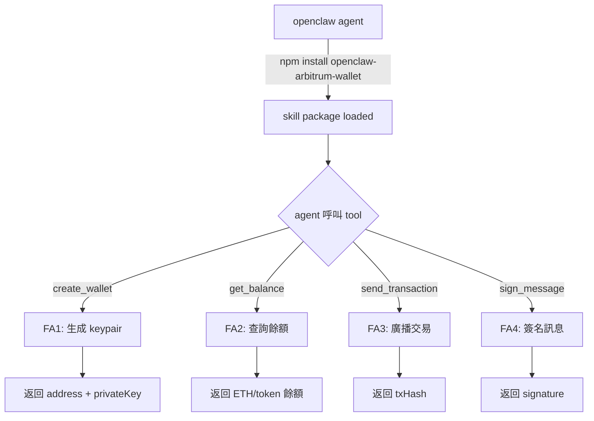
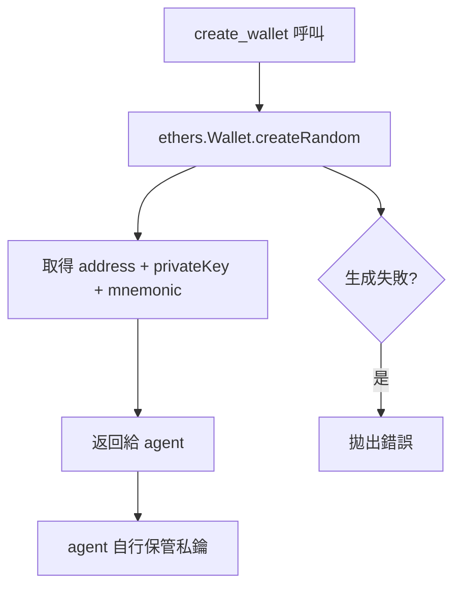
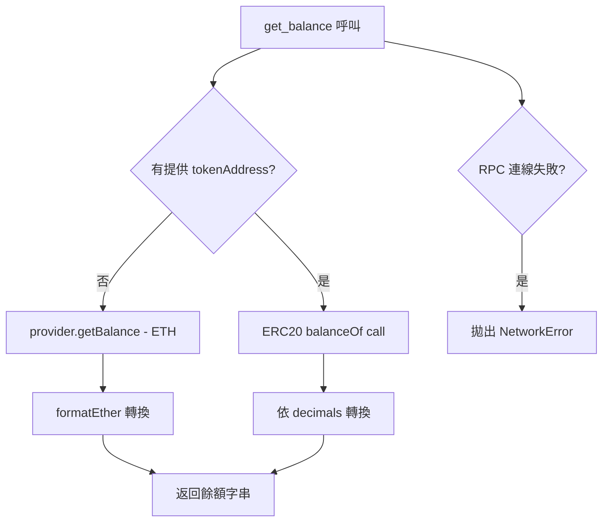
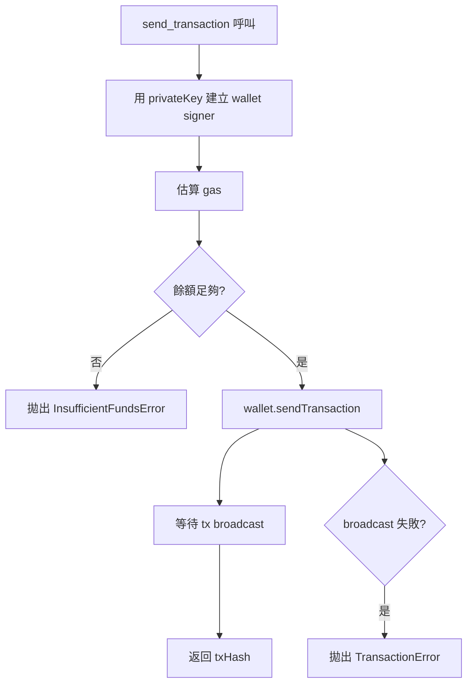
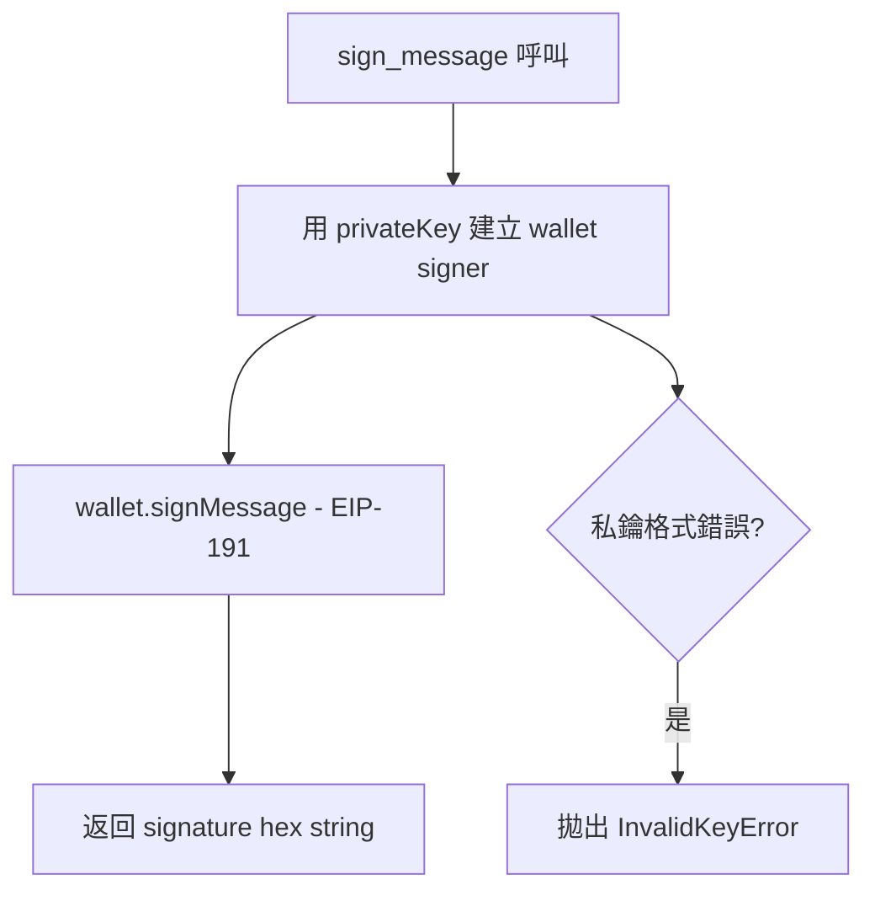

# S0 Brief Spec — openclaw-arbitrum-wallet

**版本**: 1.0.0
**日期**: 2026-03-14
**work_type**: new_feature
**spec_mode**: Full Spec

---

## §1 一句話描述

為 openclaw agent 框架開發可安裝的 NPM skill package，提供 Arbitrum 鏈上的錢包建立、餘額查詢、發送交易、訊息簽名四大功能，並透過 GitHub CLI 完成發布。

---

## §2 背景與痛點

- openclaw agent 需要與鏈上互動，但目前沒有現成 wallet skill
- skill 需要以 NPM package 形式發布，讓 openclaw agent 可以 `npm install` 安裝
- Arbitrum 是低 gas 費的 L2，是 agent 鏈上操作的合理選擇

---

## §3 目標與成功標準

**目標**：
- 開發完整的 openclaw-compatible Arbitrum wallet NPM package
- 透過 GitHub → npm publish 完成發布

**成功標準**：
- [ ] `npm install openclaw-arbitrum-wallet` 可正常安裝
- [ ] 四個 tool 全部可被 openclaw agent 呼叫並返回正確結果
- [ ] `create_wallet` 返回有效的 Arbitrum 地址 + 私鑰
- [ ] `get_balance` 能查 ETH 及指定 ERC20 餘額
- [ ] `send_transaction` 能在 Arbitrum One 上廣播交易
- [ ] `sign_message` 返回 EIP-191 簽名
- [ ] GitHub repo 為 public，npm package 發布至 npmjs

---

## §4 功能區拆解 (FA Decomposition)

### §4.1 FA 識別表

| FA ID | 名稱 | 一句話描述 | 獨立性 |
|-------|------|-----------|--------|
| FA1 | 建立錢包 | 生成新的 Arbitrum 錢包（address + privateKey） | 高 |
| FA2 | 查詢餘額 | 查詢指定地址的 ETH 及 ERC20 token 餘額 | 高 |
| FA3 | 發送交易 | 從指定私鑰帳戶發送 ETH 至目標地址 | 中（依賴 ETH 餘額） |
| FA4 | 簽名訊息 | 用私鑰對任意訊息進行 EIP-191 簽名 | 高 |
| FA5 | NPM Package 架構 | skill manifest、TypeScript 編譯、npm 發布流程 | 高 |

**拆解策略**: `single_sop_fa_labeled`（一份 SOP，按 FA 標籤組織）

---

### §4.2 核心流程圖



---

### §4.3 FA1 建立錢包流程



---

### §4.4 FA2 查詢餘額流程



---

### §4.5 FA3 發送交易流程



---

### §4.6 FA4 簽名訊息流程



---

## §5 Skill Package 架構設計

### NPM Package 結構

```
openclaw-arbitrum-wallet/
├── src/
│   ├── index.ts          # skill manifest export（openclaw 入口）
│   ├── tools/
│   │   ├── createWallet.ts
│   │   ├── getBalance.ts
│   │   ├── sendTransaction.ts
│   │   └── signMessage.ts
│   └── types.ts          # 共用 types
├── dist/                 # tsc 編譯輸出
├── package.json
├── tsconfig.json
└── README.md
```

### Skill Manifest 格式（openclaw-compatible）

```typescript
export default {
  name: "arbitrum-wallet",
  version: "1.0.0",
  description: "Arbitrum wallet management tools for openclaw agents",
  tools: [
    {
      name: "create_wallet",
      description: "Create a new Arbitrum wallet, returns address and private key",
      parameters: { type: "object", properties: {}, required: [] },
      handler: createWalletHandler
    },
    // ... 其他 tools
  ]
}
```

---

## §6 技術棧

| 項目 | 選擇 | 理由 |
|------|------|------|
| 語言 | TypeScript | 型別安全，npm 發布標準 |
| Wallet library | ethers v6 | 成熟穩定，支援 Arbitrum |
| Arbitrum RPC | `https://arb1.arbitrum.io/rpc` | 官方公開 endpoint |
| 測試 | Jest + ts-jest | NPM package 標準測試 |
| 發布 | npm publish | 透過 GitHub CLI 觸發或手動 |

---

## §7 例外情境（六維度）

| 維度 | 情境 | 處理方式 | FA |
|------|------|---------|-----|
| 網路/外部 | Arbitrum RPC 無回應 | 拋出 NetworkError，建議 agent retry | FA2, FA3 |
| 業務邏輯 | ETH 不足以支付 gas | 拋出 InsufficientFundsError，返回缺口金額 | FA3 |
| 資料邊界 | 私鑰格式錯誤 | 拋出 InvalidKeyError，不繼續執行 | FA3, FA4 |
| 業務邏輯 | ERC20 tokenAddress 無效 | 拋出 InvalidContractError | FA2 |
| 並行/競爭 | 同時發多筆交易 nonce 衝突 | 每次 sendTransaction 重新抓 nonce | FA3 |
| 資料邊界 | amount 為 0 或負數 | 參數驗證層攔截，拋出 ValidationError | FA3 |

---

## §8 範圍

**In Scope**：
- 四個 wallet tool 實作
- TypeScript + 編譯配置
- Jest 單元測試（mock RPC）
- npm publish 到 npmjs
- README 說明（安裝 + 使用範例）

**Out of Scope**：
- 私鑰持久化（agent 自行保管）
- Arbitrum Nova 鏈（只做 Arbitrum One）
- ERC20 transfer（只查詢餘額，不發送）
- Wallet import/restore（只生成新錢包）

---

## §9 約束

- 不在 package 內保存任何私鑰（純 stateless）
- 私鑰只在記憶體中使用，不寫入任何檔案
- npm package 必須是 public
