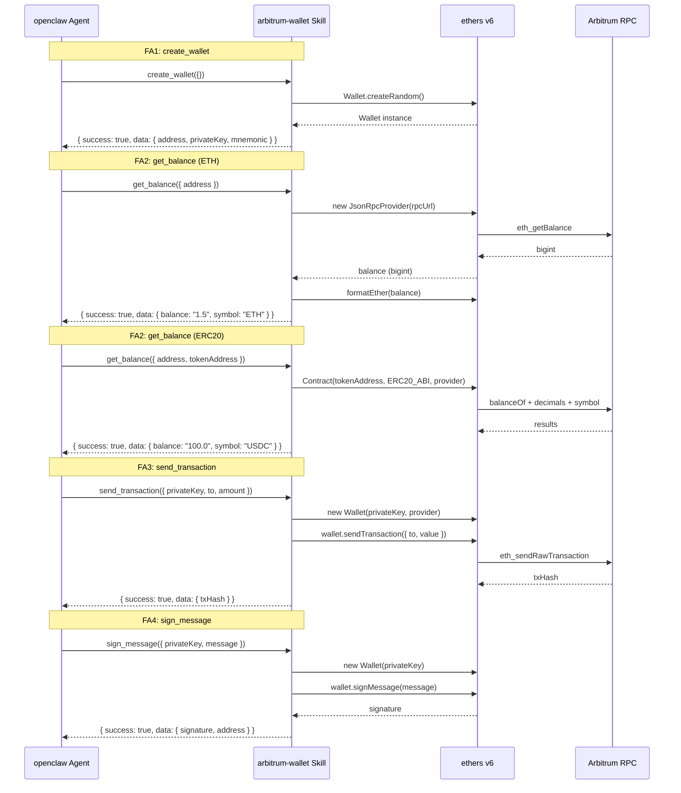

# S1 Dev Spec: openclaw-arbitrum-wallet

> **階段**: S1 技術分析
> **建立時間**: 2026-03-14 00:00
> **Agent**: codebase-explorer (Phase 1) + architect (Phase 2)
> **工作類型**: new_feature
> **複雜度**: M

---

## 1. 概述

### 1.1 需求參照
> 完整需求見 `s0_brief_spec.md`，以下僅摘要。

為 openclaw agent 框架開發一個 NPM skill package，提供 Arbitrum 鏈上錢包建立、餘額查詢、發送交易、訊息簽名四項功能。

### 1.2 技術方案摘要

建立一個純 TypeScript NPM package（CommonJS 輸出），使用 ethers v6 作為鏈上互動庫。Package export 一個符合 openclaw skill manifest 格式的物件，包含四個 tool handler。每個 handler 接收型別化參數，回傳標準化 `{ success, data?, error? }` 結構。全部 stateless，私鑰僅在 handler 執行期間存在於記憶體，不做任何持久化或日誌輸出。測試使用 Jest + ts-jest，全面 mock ethers provider，不發送真實鏈上交易。

---

## 2. 影響範圍（Phase 1：codebase-explorer）

### 2.1 受影響檔案

> 本專案為 greenfield，repo 內無既有代碼，以下全部為新增。

| 檔案 | 變更類型 | 說明 |
|------|---------|------|
| `package.json` | 新增 | NPM package 定義、依賴、scripts |
| `tsconfig.json` | 新增 | TypeScript 編譯設定（CJS 輸出） |
| `jest.config.js` | 新增 | Jest + ts-jest 測試設定 |
| `src/types.ts` | 新增 | 共用型別定義（params, responses, errors） |
| `src/index.ts` | 新增 | Skill manifest export（openclaw 入口） |
| `src/tools/createWallet.ts` | 新增 | FA1: 建立錢包 handler |
| `src/tools/getBalance.ts` | 新增 | FA2: 查詢餘額 handler |
| `src/tools/sendTransaction.ts` | 新增 | FA3: 發送交易 handler |
| `src/tools/signMessage.ts` | 新增 | FA4: 簽名訊息 handler |
| `tests/createWallet.test.ts` | 新增 | FA1 單元測試 |
| `tests/getBalance.test.ts` | 新增 | FA2 單元測試 |
| `tests/sendTransaction.test.ts` | 新增 | FA3 單元測試 |
| `tests/signMessage.test.ts` | 新增 | FA4 單元測試 |
| `.npmignore` | 新增 | 排除 src/、tests/ 等非發布檔案 |
| `.gitignore` | 新增 | 排除 node_modules/、dist/ |
| `README.md` | 新增 | 安裝與使用說明 |

### 2.2 依賴關係

- **上游依賴**:
  - `ethers` v6.x（NPM package，鏈上互動核心）
  - Arbitrum One 公開 RPC: `https://arb1.arbitrum.io/rpc`
- **下游影響**:
  - openclaw agent runtime（消費此 skill package 的上層框架）

### 2.3 現有模式與技術考量

無既有 codebase。設計時需遵循 openclaw skill manifest 格式約定（`export default { name, version, description, tools[] }`），handler 簽名統一為 `async (params: T) => Promise<HandlerResult<U>>`。

---

## 3. User Flow（Phase 2：architect）



### 3.1 主要流程

| 步驟 | Agent 動作 | 系統回應 | 備註 |
|------|-----------|---------|------|
| 1 | `npm install openclaw-arbitrum-wallet` | package 安裝至 node_modules | 一次性安裝 |
| 2 | openclaw runtime 載入 skill manifest | 註冊 4 個 tools | 透過 `require()` 或 `import` |
| 3 | Agent 呼叫任一 tool | handler 執行並回傳結果 | stateless，每次呼叫獨立 |

### 3.2 異常流程

| S0 ID | 情境 | 觸發條件 | 系統處理 | Agent 收到 |
|-------|------|---------|---------|-----------|
| E1 | RPC 無回應 | Arbitrum RPC 超時或拒絕 | 捕獲 Error，包裝為 NetworkError | `{ success: false, error: "NetworkError: ..." }` |
| E2 | ETH 不足 | 帳戶餘額不夠支付 value + gas | ethers 拋出 INSUFFICIENT_FUNDS | `{ success: false, error: "InsufficientFundsError: ..." }` |
| E3 | 私鑰格式錯誤 | privateKey 非合法 hex | ethers Wallet 建構失敗 | `{ success: false, error: "InvalidKeyError: ..." }` |
| E4 | ERC20 合約無效 | tokenAddress 不是 ERC20 合約 | balanceOf 呼叫 revert | `{ success: false, error: "InvalidContractError: ..." }` |
| E5 | amount 不合法 | amount <= 0 | 參數驗證攔截 | `{ success: false, error: "ValidationError: ..." }` |
| E6 | Nonce 衝突 | 並行送出多筆交易 | 每次重新抓 nonce（ethers 預設行為） | 正常回傳或 RPC 報錯 |
| E7 | 地址格式錯誤 | address 或 to 非合法 Ethereum 地址 | `ethers.isAddress()` 驗證失敗，參數驗證攔截 | `{ success: false, error: "ValidationError: Invalid address" }` |

### 3.3 S0 -> S1 例外追溯表

| S0 ID | 維度 | S0 描述 | S1 處理位置 | 覆蓋狀態 |
|-------|------|---------|-----------|---------|
| E1 | 網路/外部 | Arbitrum RPC 無回應 | getBalance, sendTransaction handler try/catch | ✅ 覆蓋 |
| E2 | 業務邏輯 | ETH 不足以支付 gas | sendTransaction handler 捕獲 ethers error | ✅ 覆蓋 |
| E3 | 資料邊界 | 私鑰格式錯誤 | sendTransaction, signMessage handler 捕獲 Wallet 建構錯誤 | ✅ 覆蓋 |
| E4 | 業務邏輯 | ERC20 tokenAddress 無效 | getBalance handler ERC20 分支 try/catch | ✅ 覆蓋 |
| E5 | 資料邊界 | amount 為 0 或負數 | sendTransaction handler 參數驗證 | ✅ 覆蓋 |
| E6 | 並行/競爭 | nonce 衝突 | ethers 預設行為（自動管理 nonce） | ✅ 覆蓋 |
| E7 | 資料邊界 | address/to 格式錯誤 | getBalance、sendTransaction handler 參數驗證（ethers.isAddress） | ✅ 覆蓋 |

---

## 4. Data Flow

### 4.1 Handler 型別定義（TypeScript Interface）

```typescript
// ============================================================
// 共用型別
// ============================================================

/** 標準化 handler 回傳格式 */
interface HandlerResult<T = unknown> {
  success: boolean;
  data?: T;
  error?: string;
}

/** 預設 Arbitrum One RPC */
const DEFAULT_RPC_URL = "https://arb1.arbitrum.io/rpc";

// ============================================================
// FA1: create_wallet
// ============================================================

/** create_wallet 不需要輸入參數 */
interface CreateWalletParams {}

interface CreateWalletData {
  address: string;       // 0x 開頭的 42 字元 hex
  privateKey: string;    // 0x 開頭的 66 字元 hex
  mnemonic: string;      // 12 個英文單字，空格分隔
}

type CreateWalletHandler = (params: CreateWalletParams) => Promise<HandlerResult<CreateWalletData>>;

// ============================================================
// FA2: get_balance
// ============================================================

interface GetBalanceParams {
  address: string;           // 必填：查詢的 Arbitrum 地址
  tokenAddress?: string;     // 選填：ERC20 token 合約地址，不填則查 ETH
  rpcUrl?: string;           // 選填：自訂 RPC URL，預設 Arbitrum One
}

interface GetBalanceData {
  address: string;
  balance: string;           // 人類可讀格式（已除以 decimals）
  symbol: string;            // "ETH" 或 token symbol
  decimals: number;          // 18 for ETH，或 token 的 decimals（已從 bigint 轉換為 number，ERC20 decimals 實際值在 0-255 之間，轉換安全）
  raw: string;               // 原始 wei/最小單位值（字串避免精度遺失）
}

type GetBalanceHandler = (params: GetBalanceParams) => Promise<HandlerResult<GetBalanceData>>;

// ============================================================
// FA3: send_transaction
// ============================================================

interface SendTransactionParams {
  privateKey: string;        // 必填：發送方私鑰
  to: string;                // 必填：接收方地址
  amount: string;            // 必填：ETH 數量（人類可讀格式，如 "0.1"）
  rpcUrl?: string;           // 選填：自訂 RPC URL
}

interface SendTransactionData {
  txHash: string;            // 交易 hash
  from: string;              // 發送方地址
  to: string;                // 接收方地址
  amount: string;            // 發送的 ETH 數量
}

type SendTransactionHandler = (params: SendTransactionParams) => Promise<HandlerResult<SendTransactionData>>;

// ============================================================
// FA4: sign_message
// ============================================================

interface SignMessageParams {
  privateKey: string;        // 必填：簽名用私鑰
  message: string;           // 必填：待簽名的訊息文字
}

interface SignMessageData {
  signature: string;         // EIP-191 簽名 hex 字串
  address: string;           // 簽名者地址（方便驗證）
}

type SignMessageHandler = (params: SignMessageParams) => Promise<HandlerResult<SignMessageData>>;
```

### 4.2 Skill Manifest 格式（API 設計）

```typescript
// src/index.ts — openclaw skill manifest

import { createWalletHandler } from "./tools/createWallet";
import { getBalanceHandler } from "./tools/getBalance";
import { sendTransactionHandler } from "./tools/sendTransaction";
import { signMessageHandler } from "./tools/signMessage";

const manifest = {
  name: "arbitrum-wallet",
  version: "1.0.0",
  description: "Arbitrum wallet management tools for openclaw agents",
  tools: [
    {
      name: "create_wallet",
      description: "Create a new Arbitrum wallet. Returns address, private key, and mnemonic phrase. The caller is responsible for securely storing the private key.",
      parameters: {
        type: "object",
        properties: {},
        required: []
      },
      handler: createWalletHandler
    },
    {
      name: "get_balance",
      description: "Query ETH or ERC20 token balance for an Arbitrum address.",
      parameters: {
        type: "object",
        properties: {
          address: {
            type: "string",
            description: "The Arbitrum address to query balance for (0x-prefixed)"
          },
          tokenAddress: {
            type: "string",
            description: "Optional ERC20 token contract address. If omitted, queries native ETH balance."
          },
          rpcUrl: {
            type: "string",
            description: "Optional custom RPC URL. Defaults to https://arb1.arbitrum.io/rpc"
          }
        },
        required: ["address"]
      },
      handler: getBalanceHandler
    },
    {
      name: "send_transaction",
      description: "Send ETH on Arbitrum One. Returns txHash immediately after broadcast. Does not wait for on-chain confirmation. Transaction may still revert on-chain — caller must poll the receipt to confirm success.",
      parameters: {
        type: "object",
        properties: {
          privateKey: {
            type: "string",
            description: "Sender's private key (0x-prefixed hex)"
          },
          to: {
            type: "string",
            description: "Recipient address (0x-prefixed)"
          },
          amount: {
            type: "string",
            description: "Amount of ETH to send in human-readable format (e.g. '0.1')"
          },
          rpcUrl: {
            type: "string",
            description: "Optional custom RPC URL. Defaults to https://arb1.arbitrum.io/rpc"
          }
        },
        required: ["privateKey", "to", "amount"]
      },
      handler: sendTransactionHandler
    },
    {
      name: "sign_message",
      description: "Sign a message with a private key using EIP-191 personal sign. Returns the signature and signer address.",
      parameters: {
        type: "object",
        properties: {
          privateKey: {
            type: "string",
            description: "Private key to sign with (0x-prefixed hex)"
          },
          message: {
            type: "string",
            description: "The message to sign"
          }
        },
        required: ["privateKey", "message"]
      },
      handler: signMessageHandler
    }
  ]
};

export default manifest;

// CJS interop：TypeScript 編譯為 CommonJS 後，`export default` 產生 `{ default: {...} }` 結構。
// 為讓 openclaw runtime 可直接用 require("openclaw-arbitrum-wallet") 取得 manifest（不需 .default），
// 需在編譯後的 dist/index.js 末尾（或透過 tsconfig 的 esModuleInterop 支援）加上：
//   module.exports = manifest;
//   module.exports.default = manifest;
// 實作層應確認 openclaw runtime 的 require 取用方式，並據此選擇 export 策略。
// 若 runtime 使用 require("...").default，則保留純 export default 即可。
```

### 4.3 ERC20 Minimal ABI

```typescript
// hardcoded minimal ABI，僅包含 balanceOf、decimals、symbol
const ERC20_ABI = [
  "function balanceOf(address owner) view returns (uint256)",
  "function decimals() view returns (uint8)",
  "function symbol() view returns (string)"
];
```

### 4.4 ethers v6 關鍵 API 對照

> 本專案必須使用 ethers v6 語法。以下列出與 v5 的 breaking changes，所有 handler 實作必須遵循。

| 功能 | ethers v5 (禁止) | ethers v6 (必須) |
|------|-----------------|-----------------|
| Provider | `new ethers.providers.JsonRpcProvider(url)` | `new JsonRpcProvider(url)` (直接 import) |
| 餘額型別 | `BigNumber` | `bigint` |
| 格式化 | `ethers.utils.formatEther(val)` | `formatEther(val)` (直接 import) |
| 解析 | `ethers.utils.parseEther(val)` | `parseEther(val)` (直接 import) |
| Wallet mnemonic | `wallet.mnemonic.phrase` | `wallet.mnemonic?.phrase` (Mnemonic 物件，可能為 null) |
| Contract | `new ethers.Contract(addr, abi, provider)` | `new Contract(addr, abi, provider)` (直接 import) |

---

## 5. 任務清單

### 5.1 任務總覽

| # | 任務 | FA | 類型 | 複雜度 | Agent | 依賴 |
|---|------|----|------|--------|-------|------|
| 1 | Package 架構設定 | FA5 | 基礎建設 | S | node-expert | - |
| 2 | 型別定義 | FA5 | 後端 | S | node-expert | #1 |
| 3 | createWallet handler | FA1 | 後端 | S | node-expert | #2 |
| 4 | getBalance handler | FA2 | 後端 | M | node-expert | #2 |
| 5 | sendTransaction handler | FA3 | 後端 | M | node-expert | #2 |
| 6 | signMessage handler | FA4 | 後端 | S | node-expert | #2 |
| 7 | Skill manifest | FA5 | 後端 | S | node-expert | #3, #4, #5, #6 |
| 8 | Jest 測試 | All | 測試 | M | node-expert | #3, #4, #5, #6 |
| 9 | README.md | FA5 | 文件 | S | node-expert | #7 |
| 10 | npm publish 流程 | FA5 | 基礎建設 | S | node-expert | #1 |

### 5.2 任務詳情

#### Task #1: Package 架構設定
- **FA**: FA5
- **類型**: 基礎建設
- **複雜度**: S
- **Agent**: node-expert
- **描述**: 建立 `package.json`、`tsconfig.json`、`jest.config.js`、`.gitignore`
- **設計規格**:
  - `package.json`:
    - `name`: `"openclaw-arbitrum-wallet"`
    - `version`: `"1.0.0"`
    - `main`: `"dist/index.js"`
    - `types`: `"dist/index.d.ts"`
    - `exports`: `{ ".": { "require": "./dist/index.js", "types": "./dist/index.d.ts" } }`（支援現代 bundler 精確 entry point 控制，防止消費者 deep import 內部模組）
    - `scripts.build`: `"tsc"`
    - `scripts.test`: `"jest"`
    - `scripts.prepublishOnly`: `"npm run build && npm test"`（先 build 再跑完整測試，確保發布前品質把關）
    - `dependencies`: `{ "ethers": "^6.0.0" }`
    - `devDependencies`: `{ "typescript": "^5.0.0", "ts-jest": "^29.0.0", "jest": "^29.0.0", "@types/jest": "^29.0.0" }`
    - `publishConfig.access`: `"public"`
    - `license`: `"MIT"`
    - `engines.node`: `">=18"`
  - `tsconfig.json`:
    - `target`: `"ES2020"` (支援 bigint)
    - `module`: `"commonjs"`
    - `declaration`: `true`
    - `outDir`: `"./dist"`
    - `rootDir`: `"./src"`
    - `strict`: `true`
    - `esModuleInterop`: `true`
    - `skipLibCheck`: `true`
    - `include`: `["src/**/*"]`
  - `jest.config.js`:
    - `preset`: `"ts-jest"`
    - `testEnvironment`: `"node"`
    - `testMatch`: `["**/tests/**/*.test.ts"]`
- **DoD**:
  - [ ] `npm install` 成功安裝所有依賴
  - [ ] `npm run build` 成功編譯至 dist/
  - [ ] `npm test` 能執行（即使尚無測試檔案也不報結構性錯誤）
  - [ ] `.gitignore` 包含 node_modules/ 和 dist/
- **驗收方式**: 執行 `npm install && npm run build`，確認 dist/ 目錄產生

#### Task #2: 型別定義
- **FA**: FA5
- **類型**: 後端
- **複雜度**: S
- **Agent**: node-expert
- **依賴**: Task #1
- **描述**: 建立 `src/types.ts`，定義所有 handler 的 params、response data、error 型別
- **設計規格**:
  - 匯出本 spec 4.1 定義的所有 interface
  - 匯出 `HandlerResult<T>` 泛型介面
  - 匯出 `DEFAULT_RPC_URL` 常數
  - 匯出 `ERC20_ABI` 常數（human-readable ABI 陣列）
- **DoD**:
  - [ ] `src/types.ts` 匯出所有 params 與 data interface
  - [ ] `tsc --noEmit` 通過型別檢查
  - [ ] 所有 interface 有 JSDoc 註解
- **驗收方式**: `npm run build` 成功，`dist/types.d.ts` 包含所有 export

#### Task #3: createWallet handler
- **FA**: FA1
- **類型**: 後端
- **複雜度**: S
- **Agent**: node-expert
- **依賴**: Task #2
- **描述**: 實作 `src/tools/createWallet.ts`，使用 `Wallet.createRandom()` 生成新錢包
- **設計規格**:
  - 從 `ethers` import `Wallet`
  - 呼叫 `Wallet.createRandom()`
  - 取得 `address`、`privateKey`、`mnemonic?.phrase`（v6 API）
  - `Wallet.createRandom()` 在 ethers v6 正常情況下必定有 mnemonic；若 `mnemonic` 為 null 屬於非預期狀態，**必須回傳錯誤**：`{ success: false, error: "UnexpectedError: mnemonic is null after createRandom" }`，不得 silent fallback 空字串（空字串會讓呼叫方誤以為成功但無法備份助記詞）
  - 包裝為 `HandlerResult<CreateWalletData>` 回傳
  - try/catch 捕獲任何非預期錯誤
  - **禁止** 任何 `console.log` 輸出私鑰
- **DoD**:
  - [ ] handler 回傳合法的 `{ success: true, data: { address, privateKey, mnemonic } }`
  - [ ] address 是 0x 開頭 42 字元
  - [ ] privateKey 是 0x 開頭 66 字元
  - [ ] mnemonic 是 12 個單字
  - [ ] mnemonic 為 null 時回傳 `{ success: false, error: "UnexpectedError: mnemonic is null after createRandom" }`，不得 fallback 空字串
  - [ ] 無任何 console.log 呼叫
  - [ ] 錯誤路徑回傳 `{ success: false, error: "..." }`
- **驗收方式**: 單元測試 mock `Wallet.createRandom`，驗證回傳結構

#### Task #4: getBalance handler
- **FA**: FA2
- **類型**: 後端
- **複雜度**: M
- **Agent**: node-expert
- **依賴**: Task #2
- **描述**: 實作 `src/tools/getBalance.ts`，查詢 ETH 或 ERC20 餘額
- **設計規格**:
  - 從 `ethers` import `JsonRpcProvider`, `formatEther`, `Contract`, `formatUnits`, `isAddress`
  - **參數驗證**:
    - `ethers.isAddress(params.address)` 為 false 時，立即回傳 `{ success: false, error: "ValidationError: Invalid address" }`
  - 建立 provider: `new JsonRpcProvider(params.rpcUrl ?? DEFAULT_RPC_URL)`
  - **ETH 路徑**（無 tokenAddress）:
    - `const balance = await provider.getBalance(params.address)` → 回傳 `bigint`
    - `formatEther(balance)` 轉為人類可讀
    - symbol = "ETH", decimals = 18
  - **ERC20 路徑**（有 tokenAddress）:
    - `const contract = new Contract(params.tokenAddress, ERC20_ABI, provider)`
    - 平行查詢，個別 fallback：
      ```typescript
      const [balance, decimals, symbol] = await Promise.all([
        contract.balanceOf(params.address),
        contract.decimals().catch(() => 18n),
        contract.symbol().catch(() => "UNKNOWN")
      ]);
      ```
    - `decimals` 由 ethers v6 ABI codec 解析為 `bigint`（uint8），必須轉換：`const decimalsNum = Number(decimals)`（ERC20 decimals 實際值在 0-255 之間，`Number()` 轉換安全無精度問題）
    - `formatUnits(balance, decimalsNum)` 轉為人類可讀
    - `GetBalanceData.decimals` 欄位儲存 `decimalsNum`（number 型別）
  - `raw` 欄位：原始值轉字串 `balance.toString()`
  - 錯誤分類：
    - RPC 連線失敗 → `NetworkError: ...`
    - ERC20 合約無效（balanceOf revert）→ `InvalidContractError: ...`
- **DoD**:
  - [ ] `address` 格式驗證：非合法 Ethereum 地址時回傳 ValidationError
  - [ ] ETH 查詢路徑正確回傳 balance、symbol="ETH"、decimals=18
  - [ ] ERC20 查詢路徑正確回傳 balance、symbol、decimals
  - [ ] ERC20 decimals fallback 為 18（使用個別 `.catch(() => 18n)` 實現，不依賴 Promise.all 整體捕獲）
  - [ ] ERC20 symbol fallback 為 "UNKNOWN"（使用個別 `.catch(() => "UNKNOWN")` 實現）
  - [ ] ERC20 decimals bigint 轉 number：`Number(decimals)`，並在型別上標註轉換位置
  - [ ] RPC 失敗回傳 NetworkError
  - [ ] 無效 ERC20 地址回傳 InvalidContractError
  - [ ] raw 欄位為原始 wei 字串
- **驗收方式**: 單元測試 mock provider 和 contract，分別驗證 ETH 與 ERC20 路徑

#### Task #5: sendTransaction handler
- **FA**: FA3
- **類型**: 後端
- **複雜度**: M
- **Agent**: node-expert
- **依賴**: Task #2
- **描述**: 實作 `src/tools/sendTransaction.ts`，發送 ETH 交易
- **設計規格**:
  - 從 `ethers` import `Wallet`, `JsonRpcProvider`, `parseEther`, `isAddress`
  - **參數驗證**:
    - `ethers.isAddress(params.to)` 為 false 時，立即回傳 `{ success: false, error: "ValidationError: Invalid recipient address" }`
    - `amount` 必須 > 0（用 `parseEther(amount)` 後比較 `> 0n`）；驗證失敗回傳 `ValidationError`
  - 建立 provider 和 wallet:
    - `const provider = new JsonRpcProvider(params.rpcUrl ?? DEFAULT_RPC_URL)`
    - `const wallet = new Wallet(params.privateKey, provider)`
  - 發送交易:
    - `const tx = await wallet.sendTransaction({ to: params.to, value: parseEther(params.amount) })`
    - gas 由 ethers 自動估算（不手動指定 gasLimit）
  - 回傳: `{ txHash: tx.hash, from: wallet.address, to: params.to, amount: params.amount }`
  - **不** await `tx.wait()`（fire-and-forget：只等廣播，不等鏈上確認）
  - 錯誤分類：
    - 私鑰格式錯誤 → `InvalidKeyError`
    - 餘額不足 → `InsufficientFundsError`
    - RPC 失敗 → `NetworkError`
    - 其他 → `TransactionError`
  - **禁止** console.log privateKey
- **DoD**:
  - [ ] 參數驗證：`to` 非合法 Ethereum 地址時回傳 ValidationError
  - [ ] 參數驗證：amount <= 0 回傳 ValidationError
  - [ ] 正確建立 Wallet(privateKey, provider)
  - [ ] 正確呼叫 sendTransaction 並回傳 txHash
  - [ ] 私鑰錯誤回傳 InvalidKeyError
  - [ ] 餘額不足回傳 InsufficientFundsError
  - [ ] RPC 失敗回傳 NetworkError
  - [ ] 無任何 console.log 呼叫
- **驗收方式**: 單元測試 mock Wallet 和 provider，驗證正常與所有錯誤路徑

#### Task #6: signMessage handler
- **FA**: FA4
- **類型**: 後端
- **複雜度**: S
- **Agent**: node-expert
- **依賴**: Task #2
- **描述**: 實作 `src/tools/signMessage.ts`，使用 EIP-191 簽名訊息
- **設計規格**:
  - 從 `ethers` import `Wallet`
  - 建立 wallet: `const wallet = new Wallet(params.privateKey)`（不需 provider）
  - 簽名: `const signature = await wallet.signMessage(params.message)`
  - 回傳: `{ signature, address: wallet.address }`
  - 錯誤分類：
    - 私鑰格式錯誤 → `InvalidKeyError`
  - **禁止** console.log privateKey
- **DoD**:
  - [ ] 正確使用 EIP-191 簽名（ethers `signMessage` 即是 EIP-191）
  - [ ] 回傳 signature 和 signer address
  - [ ] 私鑰錯誤回傳 InvalidKeyError
  - [ ] 無任何 console.log 呼叫
- **驗收方式**: 單元測試用已知私鑰簽名已知訊息，比對 signature

#### Task #7: Skill manifest
- **FA**: FA5
- **類型**: 後端
- **複雜度**: S
- **Agent**: node-expert
- **依賴**: Task #3, #4, #5, #6
- **描述**: 實作 `src/index.ts`，組裝 skill manifest 並 export default
- **設計規格**:
  - import 四個 handler
  - 按 4.2 節定義的結構組裝 manifest
  - `export default` 整個物件
  - 同時具名匯出各 handler（方便單獨測試使用）
  - **CJS interop 說明**：TypeScript `export default` 編譯為 CommonJS 後，`require("openclaw-arbitrum-wallet")` 取得的是 `{ default: manifest, ... }` 結構，**不是** manifest 本體。openclaw runtime 須用 `require("openclaw-arbitrum-wallet").default` 取得 manifest。若 runtime 預期直接 `require()` 即得 manifest（不需 `.default`），則實作層需在 `dist/index.js` 末尾加上 `module.exports = manifest; module.exports.default = manifest;` 的 CJS 雙重 export 寫法。
- **DoD**:
  - [ ] `export default` 包含 name, version, description, tools[]
  - [ ] tools 有 4 個 tool，各有 name, description, parameters, handler
  - [ ] parameters 符合 JSON Schema 格式
  - [ ] `require("openclaw-arbitrum-wallet").default` 可取得 manifest（TypeScript export default 編譯為 CJS 後需用 .default 存取；若 runtime 預期直接 require，需加 CJS 雙重 export）
- **驗收方式**: `npm run build` 後，`node -e "const s = require('./dist'); console.log(s.default.tools.length)"` 輸出 4

#### Task #8: Jest 測試
- **FA**: All
- **類型**: 測試
- **複雜度**: M
- **Agent**: node-expert
- **依賴**: Task #3, #4, #5, #6
- **描述**: 為四個 handler 撰寫單元測試，全面 mock ethers
- **設計規格**:
  - `tests/createWallet.test.ts`:
    - mock `Wallet.createRandom` 回傳固定 wallet
    - 驗證 success 路徑回傳結構
    - 驗證異常路徑回傳 error
  - `tests/getBalance.test.ts`:
    - mock `JsonRpcProvider` 和 `Contract`
    - 測試 ETH 路徑（`getBalance` 回傳 `BigInt("1500000000000000000")`）
    - 測試 ERC20 路徑
    - 測試 ERC20 decimals fallback（mock `contract.decimals()` 拋錯，驗證結果 decimals=18）
    - 測試 ERC20 symbol fallback（mock `contract.symbol()` 拋錯，驗證結果 symbol="UNKNOWN"）
    - 測試無效 ERC20 地址回傳 InvalidContractError（mock `contract.balanceOf()` revert）
    - 測試 RPC 失敗（mock provider 拋錯，驗證回傳 NetworkError）
  - `tests/sendTransaction.test.ts`:
    - mock `Wallet` 和 `JsonRpcProvider`
    - 測試正常發送（回傳 txHash）
    - 測試 amount <= 0 驗證
    - 測試 to 地址格式錯誤（非合法 Ethereum 地址，回傳 ValidationError）
    - 測試私鑰錯誤
    - 測試餘額不足
  - `tests/signMessage.test.ts`:
    - mock `Wallet`
    - 測試正常簽名
    - 測試私鑰錯誤
  - **bigint 注意**: Jest mock 回傳值使用 `BigInt(...)` 而非 `new BigNumber(...)`
- **DoD**:
  - [ ] 4 個測試檔案全部存在
  - [ ] `npm test` 全部通過
  - [ ] 每個 handler 至少覆蓋：正常路徑 + 至少一個錯誤路徑
  - [ ] `getBalance` 測試覆蓋：ETH 路徑、ERC20 路徑、decimals fallback、symbol fallback、InvalidContractError、RPC 失敗
  - [ ] `sendTransaction` 測試覆蓋：正常路徑、amount 驗證、to 地址驗證、私鑰錯誤、餘額不足
  - [ ] 無真實 RPC 呼叫（全 mock）
- **驗收方式**: `npm test -- --coverage`，所有測試綠燈

#### Task #9: README.md
- **FA**: FA5
- **類型**: 文件
- **複雜度**: S
- **Agent**: node-expert
- **依賴**: Task #7
- **描述**: 撰寫 README，包含安裝、使用範例、API 文件、安全注意事項
- **設計規格**:
  - 安裝指令: `npm install openclaw-arbitrum-wallet`
  - 每個 tool 的使用範例（TypeScript code snippet）
  - 參數說明表
  - 安全警告：私鑰責任歸屬、不做持久化
  - **fire-and-forget 警告**：明確說明 `send_transaction` 為 fire-and-forget，txHash 不代表交易成功，agent 需自行 poll receipt（如 `provider.getTransactionReceipt(txHash)`）確認上鏈結果
  - **私鑰 logging 警告**：明確警告 `privateKey` 會出現在 tool call 的 JSON 參數中，呼叫方的 agent runtime 必須確保 tool call input params 不被記錄至 persistent logs；本 package 無法控制 runtime 側的 logging 行為
  - **RPC 建議**：說明預設公開 RPC（`arb1.arbitrum.io/rpc`）有速率限制，production 環境建議使用私人 RPC（Alchemy / Infura / QuickNode）並透過 `rpcUrl` 參數傳入，避免速率限制影響可靠性
  - License: MIT
- **DoD**:
  - [ ] README 包含安裝、4 個 tool 的使用範例
  - [ ] README 包含安全注意事項（私鑰責任歸屬、不做持久化）
  - [ ] README 說明 `send_transaction` 為 fire-and-forget，需自行 poll receipt 確認成功
  - [ ] README 明確警告 privateKey 會出現在 tool call JSON 參數中，呼叫方需確保 runtime 不記錄 tool inputs
  - [ ] README 建議在 production 環境使用私人 RPC（Alchemy / Infura / QuickNode），避免公開節點速率限制
  - [ ] README 包含 License
- **驗收方式**: 人工閱讀確認完整性

#### Task #10: npm publish 流程
- **FA**: FA5
- **類型**: 基礎建設
- **複雜度**: S
- **Agent**: node-expert
- **依賴**: Task #1
- **描述**: 建立 `.npmignore` 並確保 publish 流程正確
- **設計規格**:
  - `.npmignore` 排除:
    - `src/`（只發布 dist/）
    - `tests/`
    - `tsconfig.json`
    - `jest.config.js`
    - `.gitignore`
    - `node_modules/`
  - `package.json` 已包含 `prepublishOnly: "npm run build && npm test"` 和 `publishConfig.access: "public"`
  - **發布前置步驟**（manual publish 流程）：
    1. `npm login`（或設定 `NPM_TOKEN` 環境變數）：發布前必須完成 npmjs.com 認證
    2. `npm test`：確認所有測試通過（`prepublishOnly` 會自動執行，此步驟為手動確認）
    3. `npm publish`：觸發 `prepublishOnly`（build + test），完成發布
  - **CI/CD 決策**：本次採用手動 `npm publish` 流程（不建立 GitHub Actions workflow）；若未來需要自動化發布，可新增 `.github/workflows/publish.yml` 並透過 GitHub Secrets 設定 `NPM_TOKEN`
- **DoD**:
  - [ ] `.npmignore` 存在且排除非必要檔案
  - [ ] `npm pack` 產出的 tarball 只包含 dist/、package.json、README.md
  - [ ] `npm pack --dry-run` 列出的檔案無 src/ 和 tests/
  - [ ] `npm test` 全部通過後才能執行 `npm publish`（`prepublishOnly` 強制執行 build + test）
  - [ ] README 或 CONTRIBUTING 文件說明 `npm login` / `NPM_TOKEN` 設定方式（使用者初次發布需知）
- **驗收方式**: `npm pack --dry-run` 檢查檔案列表；`npm publish` 前確認 `npm login` 已完成

---

## 6. 技術決策

### 6.1 架構決策

| 決策點 | 選項 | 選擇 | 理由 |
|--------|------|------|------|
| 模組系統 | CommonJS / ESM | CommonJS | openclaw agent runtime 預期使用 `require()` 載入 skill；CJS 相容性最廣；ESM 在 Node.js 仍有 interop 問題 |
| ethers 版本 | v5 / v6 | v6 | v6 使用原生 bigint 更安全（無浮點精度問題）；v5 已進入維護模式；v6 bundle size 更小 |
| handler 回傳格式 | 直接 throw / Result 物件 | Result 物件 | `{ success, data?, error? }` 讓 agent runtime 不需 try/catch 即可判斷成敗；錯誤資訊結構化 |
| gasLimit | 手動指定 / ethers 自動估算 | ethers 自動估算 | ETH transfer gas 固定 21000，ethers 自動處理即可；避免 hardcode 過高或過低 |
| ERC20 ABI | 完整 ABI / minimal human-readable | minimal human-readable | 只需 balanceOf、decimals、symbol 三個函數；human-readable ABI 是 ethers v6 推薦格式 |
| ERC20 decimals fallback | 嚴格報錯 / fallback 18 | fallback 18 | 多數 ERC20 使用 18 decimals；某些 proxy contract 的 decimals() 可能失敗；fallback 18 保持可用性 |
| RPC URL | hardcode / 可配置 | 可配置（有預設值） | 預設 `arb1.arbitrum.io/rpc` 但允許傳入自訂 RPC，給 agent 彈性 |
| 等待交易確認 | `tx.wait()` / 僅回傳 hash | 僅回傳 hash | agent 可自行決定是否等待確認；減少 handler 阻塞時間 |

### 6.2 設計模式

- **Pattern**: Stateless Handler（無狀態處理器）
- **理由**: 每次 tool 呼叫獨立，不保留任何狀態。Provider 在 handler 內建立，handler 結束後 GC 回收。私鑰變數只存在於 handler scope 內。這是最安全的設計 -- 無 singleton、無 cache、無 side effect。

### 6.3 私鑰安全策略

| 規則 | 說明 |
|------|------|
| 不持久化 | 私鑰僅在 handler 函數執行期間存在於記憶體 |
| 不記錄 | handler 內禁止任何 `console.log`、`console.error` 等輸出私鑰 |
| 不快取 | 不使用任何模組級變數儲存私鑰 |
| 責任歸屬 | README 明確聲明：私鑰安全責任歸呼叫方（agent runtime） |
| Scope 限制 | 私鑰只在 `const wallet = new Wallet(privateKey)` 這一行使用，之後透過 wallet 物件操作 |
| **Agent runtime logging 風險** | `send_transaction` 和 `sign_message` 的 `privateKey` 欄位是明文字串，會出現在 tool call 的 JSON-serialized input params 中。若 agent runtime 記錄任何形式的 tool call 請求（conversation history、request logs），私鑰就會被持久化至 log 儲存體。**本 package 無法控制此行為**；呼叫方（agent runtime）必須確保 tool call input params 不被記錄至 persistent logs。此風險應在 README 中明確聲明。 |

---

## 7. 驗收標準

### 7.1 功能驗收

| # | 場景 | Given | When | Then | FA | 優先級 |
|---|------|-------|------|------|----|--------|
| 1 | 建立新錢包 | skill 已載入 | 呼叫 `create_wallet({})` | 回傳 `{ success: true, data: { address: "0x...", privateKey: "0x...", mnemonic: "word1 word2 ..." } }`，address 42 字元、privateKey 66 字元、mnemonic 12 個單字 | FA1 | P0 |
| 2 | 查詢 ETH 餘額 | 已知地址在 Arbitrum One 有 ETH | 呼叫 `get_balance({ address: "0x..." })` | 回傳 `{ success: true, data: { balance: "1.5", symbol: "ETH", decimals: 18, raw: "1500000000000000000" } }` | FA2 | P0 |
| 3 | 查詢 ERC20 餘額 | 已知地址持有 USDC | 呼叫 `get_balance({ address: "0x...", tokenAddress: "0x..." })` | 回傳正確的 token balance、symbol、decimals | FA2 | P0 |
| 4 | 發送 ETH | 帳戶有足夠 ETH | 呼叫 `send_transaction({ privateKey, to, amount: "0.01" })` | 回傳 `{ success: true, data: { txHash: "0x...", from, to, amount } }` | FA3 | P0 |
| 5 | 簽名訊息 | 有合法私鑰 | 呼叫 `sign_message({ privateKey, message: "hello" })` | 回傳 `{ success: true, data: { signature: "0x...", address: "0x..." } }`，signature 可用 `verifyMessage` 還原出相同 address | FA4 | P0 |
| 6 | RPC 失敗 | Arbitrum RPC 不可用 | 呼叫 `get_balance` | 回傳 `{ success: false, error: "NetworkError: ..." }` | FA2 | P1 |
| 7 | 私鑰格式錯誤 | 傳入 "not-a-key" | 呼叫 `send_transaction` 或 `sign_message` | 回傳 `{ success: false, error: "InvalidKeyError: ..." }` | FA3/FA4 | P1 |
| 8 | 金額不合法 | amount = "0" 或 "-1" | 呼叫 `send_transaction` | 回傳 `{ success: false, error: "ValidationError: ..." }` | FA3 | P1 |
| 9 | npm install 可用 | package 已發布 | `npm install openclaw-arbitrum-wallet` | 安裝成功，`require("openclaw-arbitrum-wallet").default` 回傳含 4 個 tools 的 manifest | FA5 | P0 |

### 7.2 非功能驗收

| 項目 | 標準 |
|------|------|
| 安全 | handler 原始碼不含任何 console.log / console.error 輸出私鑰的語句 |
| 型別安全 | `tsc --noEmit` 零錯誤 |
| 測試覆蓋 | 所有 handler 正常路徑 + 至少一個錯誤路徑有對應測試 |
| Package size | `npm pack` 產出的 tarball 不含 src/、tests/ |

### 7.3 測試計畫

- **單元測試**: 4 個 handler 各自測試，mock ethers provider/wallet/contract（Task #8）
- **整合測試**: 不適用（無 DB、無 API server）
- **E2E 測試**: 不適用（需真實 Arbitrum 帳戶和 ETH，不納入自動化）；可手動在 Arbitrum Sepolia testnet 驗證

---

## 8. 風險與緩解

| 風險 | 影響 | 機率 | 緩解措施 | 負責 |
|------|------|------|---------|------|
| 私鑰記憶體洩漏 | 高 | 低 | handler 內禁止 console.log；私鑰僅在 handler scope 內使用；README 聲明安全責任 | node-expert |
| Agent runtime logging 記錄私鑰 | 高 | 中 | §6.3 明確列為已知風險；README 強制說明；呼叫方需自行確保 runtime 不記錄 tool inputs | node-expert |
| ethers v6 API 誤用 | 中 | 中 | dev_spec 明確列出 v6 正確 API（4.4 節對照表）；型別定義使用 bigint 非 BigNumber | node-expert |
| Arbitrum RPC 不穩定 | 中 | 中 | handler 加 try/catch 包裝為 NetworkError；支援自訂 rpcUrl 參數 | node-expert |
| npm package name 被佔用 | 低 | 低 | 發布前 `npm search openclaw-arbitrum-wallet`；備案使用 `@sooneocean/openclaw-arbitrum-wallet` | node-expert |
| Jest mock bigint 相容性 | 中 | 中 | mock 回傳值使用 `BigInt(...)` 語法；確保 tsconfig target 為 ES2020+ | node-expert |
| 真實交易測試風險 | 高 | 低 | 全部使用 Jest mock，不做真實鏈上交易；E2E 驗證使用 testnet（手動、可選） | node-expert |

### Unknown 決策說明

以下 Unknowns 在 Phase 1 已識別，本 spec 採用以下設計決策：

| Unknown | 決策 | 理由 |
|---------|------|------|
| openclaw skill manifest 格式 | `export default { name, version, description, tools[] }`，parameters 使用 JSON Schema | 基於已知的 openclaw 範例，JSON Schema 是最通用格式 |
| handler 簽名 | `async (params: T) => Promise<HandlerResult<U>>` | Result 物件模式比 throw 更適合 agent runtime 消費 |
| ERC20 ABI 來源 | hardcode minimal human-readable ABI | 只需 3 個函數，動態 fetch 不必要且增加複雜度 |
| gasLimit | ethers 自動估算 | ETH transfer 固定 21000，ethers 處理即可 |
| ERC20 decimals fallback | 查詢失敗時預設 18 | 多數 token 使用 18 decimals，保持可用性 |
| npm package name | 先用 `openclaw-arbitrum-wallet`，被佔用則改 scoped | 發布時確認 |
| require() vs require().default | openclaw runtime 使用 `require("...").default` 取得 manifest | TypeScript export default 編譯 CJS 的標準行為；若 runtime 需直接 require，實作層需加 CJS 雙重 export |

---

## SDD Context

```json
{
  "stages": {
    "s1": {
      "status": "completed",
      "agents": ["codebase-explorer", "architect"],
      "output": {
        "completed_phases": [1, 2],
        "dev_spec_path": "dev/specs/openclaw-arbitrum-wallet/s1_dev_spec.md",
        "solution_summary": "Greenfield TypeScript NPM package using ethers v6, CommonJS output, 4 stateless tool handlers with standardized Result object return format",
        "tasks": 10,
        "acceptance_criteria": 9
      }
    }
  }
}
```
