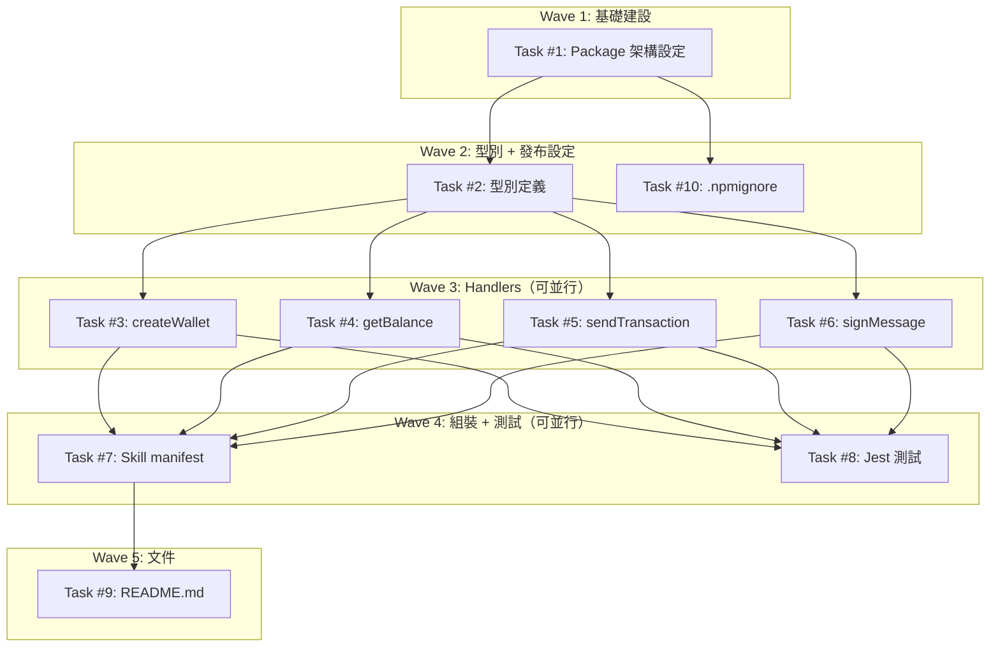

# S3 Implementation Plan: openclaw-arbitrum-wallet

> **階段**: S3 實作計畫
> **建立時間**: 2026-03-14 02:00
> **Agent**: architect
> **Spec Mode**: Full Spec

---

## 1. 概述

### 1.1 功能目標
為 openclaw agent 框架開發一個 NPM skill package（`openclaw-arbitrum-wallet`），提供 Arbitrum 鏈上錢包建立、餘額查詢、發送交易、訊息簽名四項功能。Greenfield TypeScript package，CommonJS 輸出，使用 ethers v6，全 stateless handler。

### 1.2 實作範圍
- **範圍內**: create_wallet、get_balance、send_transaction、sign_message 四個 tool handler；TypeScript + 編譯設定；Jest 單元測試（全 mock）；npm publish 流程；README
- **範圍外**: 私鑰持久化、Arbitrum Nova、ERC20 transfer、wallet import/restore、GitHub Actions CI/CD

### 1.3 關聯文件
| 文件 | 路徑 | 狀態 |
|------|------|------|
| Brief Spec | `./s0_brief_spec.md` | ✅ |
| Dev Spec | `./s1_dev_spec.md` | ✅ |
| Review Report | `./s2_review_report.md` | ✅ |
| Implementation Plan | `./s3_implementation_plan.md` | 📝 當前 |

---

## 2. 實作任務清單

### 2.1 任務總覽

| # | 任務 | 類型 | Agent | 依賴 | 複雜度 | source_ref | TDD | 狀態 |
|---|------|------|-------|------|--------|------------|-----|------|
| 1 | Package 架構設定 | 基礎建設 | `node-expert` | - | S | FA5 | ⛔ | ⬜ |
| 2 | 型別定義 | 後端 | `node-expert` | #1 | S | FA5 | ✅ | ⬜ |
| 3 | createWallet handler | 後端 | `node-expert` | #2 | S | FA1 | ✅ | ⬜ |
| 4 | getBalance handler | 後端 | `node-expert` | #2 | M | FA2 | ✅ | ⬜ |
| 5 | sendTransaction handler | 後端 | `node-expert` | #2 | M | FA3 | ✅ | ⬜ |
| 6 | signMessage handler | 後端 | `node-expert` | #2 | S | FA4 | ✅ | ⬜ |
| 7 | Skill manifest (index.ts) | 後端 | `node-expert` | #3, #4, #5, #6 | S | FA5 | ✅ | ⬜ |
| 8 | Jest 測試 | 測試 | `node-expert` | #3, #4, #5, #6 | M | All | ✅ | ⬜ |
| 9 | README.md | 文件 | `node-expert` | #7 | S | FA5 | ⛔ | ⬜ |
| 10 | npm publish 流程 (.npmignore) | 基礎建設 | `node-expert` | #1 | S | FA5 | ⛔ | ⬜ |

**狀態圖例**：⬜ pending | 🔄 in_progress | ✅ completed | ❌ blocked | ⏭️ skipped
**複雜度**：S（<30min）| M（30min-2hr）| L（>2hr）
**TDD**: ✅ = has tdd_plan | ⛔ = N/A (skip_justification required)

---

## 3. 任務詳情

### Task #1: Package 架構設定

**基本資訊**
| 項目 | 內容 |
|------|------|
| 類型 | 基礎建設 |
| Agent | `node-expert` |
| 複雜度 | S |
| 依賴 | - |
| source_ref | FA5 |
| 狀態 | ⬜ pending |

**描述**
建立 `package.json`、`tsconfig.json`、`jest.config.js`、`.gitignore`，完成專案骨架。

**輸入**
- 無前置條件（greenfield）

**輸出**
- 可執行 `npm install`、`npm run build`、`npm test` 的專案結構

**受影響檔案**
| 檔案 | 變更類型 | 說明 |
|------|---------|------|
| `package.json` | 新增 | NPM package 定義、依賴、scripts |
| `tsconfig.json` | 新增 | TypeScript CJS 編譯設定 |
| `jest.config.js` | 新增 | Jest + ts-jest 設定 |
| `.gitignore` | 新增 | node_modules/、dist/ |

**DoD（完成定義）**
- [ ] `npm install` 成功安裝所有依賴
- [ ] `npm run build` 成功編譯至 dist/
- [ ] `npm test` 能執行（即使尚無測試檔案也不報結構性錯誤）
- [ ] `.gitignore` 包含 node_modules/ 和 dist/
- [ ] `package.json` 含 `exports` 欄位：`{ ".": { "require": "./dist/index.js", "types": "./dist/index.d.ts" } }`
- [ ] `scripts.prepublishOnly` = `"npm run build && npm test"`

**TDD Plan**: N/A -- 純設定檔，無可測邏輯。驗證方式為指令執行成功。

**驗證方式**
```bash
npm install && npm run build
ls dist/  # 確認目錄存在
```

**實作備註**
- `tsconfig.json` target 必須 `ES2020`（支援 bigint）
- `engines.node` >= 18
- `publishConfig.access` = `"public"`
- dev_spec Task #1 有完整欄位規格，直接照搬

---

### Task #2: 型別定義

**基本資訊**
| 項目 | 內容 |
|------|------|
| 類型 | 後端 |
| Agent | `node-expert` |
| 複雜度 | S |
| 依賴 | Task #1 |
| source_ref | FA5 |
| 狀態 | ⬜ pending |

**描述**
建立 `src/types.ts`，定義所有 handler 的 params、response data、HandlerResult 泛型介面、DEFAULT_RPC_URL 常數、ERC20_ABI 常數。

**輸入**
- Task #1 完成的專案骨架

**輸出**
- `src/types.ts` 匯出完整型別定義

**受影響檔案**
| 檔案 | 變更類型 | 說明 |
|------|---------|------|
| `src/types.ts` | 新增 | 共用型別、常數 |

**DoD（完成定義）**
- [ ] 匯出 `HandlerResult<T>`、`CreateWalletParams`、`CreateWalletData`、`GetBalanceParams`、`GetBalanceData`、`SendTransactionParams`、`SendTransactionData`、`SignMessageParams`、`SignMessageData`
- [ ] 匯出 `DEFAULT_RPC_URL` 常數 = `"https://arb1.arbitrum.io/rpc"`
- [ ] 匯出 `ERC20_ABI` 常數（human-readable ABI，含 balanceOf、decimals、symbol）
- [ ] `tsc --noEmit` 通過型別檢查
- [ ] 所有 interface 有 JSDoc 註解

**TDD Plan**
| 項目 | 內容 |
|------|------|
| 測試檔案 | `tests/types.test.ts` |
| 測試指令 | `npm test -- --testPathPattern=types` |
| 預期失敗測試 | `should export DEFAULT_RPC_URL as valid URL`, `should export ERC20_ABI with 3 entries` |

**驗證方式**
```bash
npx tsc --noEmit
npm test -- --testPathPattern=types
```

**實作備註**
- 完整 interface 定義見 dev_spec 4.1 節，直接照搬
- `GetBalanceData.decimals` 型別為 `number`（不是 bigint），轉換在 handler 層做

---

### Task #3: createWallet handler

**基本資訊**
| 項目 | 內容 |
|------|------|
| 類型 | 後端 |
| Agent | `node-expert` |
| 複雜度 | S |
| 依賴 | Task #2 |
| source_ref | FA1 |
| 狀態 | ⬜ pending |

**描述**
實作 `src/tools/createWallet.ts`，使用 `Wallet.createRandom()` 生成新 Arbitrum 錢包，回傳 address、privateKey、mnemonic。

**輸入**
- Task #2 完成的型別定義

**輸出**
- `src/tools/createWallet.ts` 匯出 `createWalletHandler`

**受影響檔案**
| 檔案 | 變更類型 | 說明 |
|------|---------|------|
| `src/tools/createWallet.ts` | 新增 | FA1 handler |

**DoD（完成定義）**
- [ ] handler 回傳合法的 `{ success: true, data: { address, privateKey, mnemonic } }`
- [ ] address 是 0x 開頭 42 字元
- [ ] privateKey 是 0x 開頭 66 字元
- [ ] mnemonic 是 12 個單字
- [ ] mnemonic 為 null 時回傳 `{ success: false, error: "UnexpectedError: mnemonic is null after createRandom" }`
- [ ] 無任何 console.log 呼叫
- [ ] 錯誤路徑回傳 `{ success: false, error: "..." }`

**TDD Plan**
| 項目 | 內容 |
|------|------|
| 測試檔案 | `tests/createWallet.test.ts` |
| 測試指令 | `npm test -- --testPathPattern=createWallet` |
| 預期失敗測試 | `should return address, privateKey, mnemonic on success`, `should return error when mnemonic is null`, `should return error on unexpected exception` |

**驗證方式**
```bash
npm test -- --testPathPattern=createWallet
```

**實作備註**
- ethers v6 的 `Wallet.createRandom()` 回傳的 mnemonic 透過 `wallet.mnemonic?.phrase` 取得
- mnemonic null **必須報錯**，不得 fallback 空字串（S2 SR-011 修正）

---

### Task #4: getBalance handler

**基本資訊**
| 項目 | 內容 |
|------|------|
| 類型 | 後端 |
| Agent | `node-expert` |
| 複雜度 | M |
| 依賴 | Task #2 |
| source_ref | FA2 |
| 狀態 | ⬜ pending |

**描述**
實作 `src/tools/getBalance.ts`，查詢指定地址的 ETH 或 ERC20 token 餘額。支援 `ethers.isAddress()` 地址驗證、ERC20 decimals/symbol 個別 fallback。

**輸入**
- Task #2 完成的型別定義

**輸出**
- `src/tools/getBalance.ts` 匯出 `getBalanceHandler`

**受影響檔案**
| 檔案 | 變更類型 | 說明 |
|------|---------|------|
| `src/tools/getBalance.ts` | 新增 | FA2 handler |

**DoD（完成定義）**
- [ ] address 格式驗證：非合法 Ethereum 地址時回傳 `ValidationError`
- [ ] ETH 查詢路徑回傳 balance、symbol="ETH"、decimals=18、raw
- [ ] ERC20 查詢路徑回傳 balance、symbol、decimals、raw
- [ ] ERC20 decimals fallback 為 18（個別 `.catch(() => 18n)`）
- [ ] ERC20 symbol fallback 為 "UNKNOWN"（個別 `.catch(() => "UNKNOWN")`）
- [ ] ERC20 decimals bigint → number 轉換：`Number(decimals)`
- [ ] RPC 失敗回傳 `NetworkError`
- [ ] 無效 ERC20 地址（balanceOf revert）回傳 `InvalidContractError`
- [ ] raw 欄位為原始 wei 字串

**TDD Plan**
| 項目 | 內容 |
|------|------|
| 測試檔案 | `tests/getBalance.test.ts` |
| 測試指令 | `npm test -- --testPathPattern=getBalance` |
| 預期失敗測試 | `should return ETH balance`, `should return ERC20 balance`, `should fallback decimals to 18 on error`, `should fallback symbol to UNKNOWN on error`, `should return ValidationError for invalid address`, `should return NetworkError on RPC failure`, `should return InvalidContractError on balanceOf revert` |

**驗證方式**
```bash
npm test -- --testPathPattern=getBalance
```

**實作備註**
- `Promise.all` 內每個 promise 個別 `.catch()`（S2 SR-005 修正）
- `isAddress()` 驗證要在建立 provider 之前執行（S2 SR-007）
- ethers v6 的 `contract.decimals()` 回傳 `bigint`，需 `Number()` 轉換

---

### Task #5: sendTransaction handler

**基本資訊**
| 項目 | 內容 |
|------|------|
| 類型 | 後端 |
| Agent | `node-expert` |
| 複雜度 | M |
| 依賴 | Task #2 |
| source_ref | FA3 |
| 狀態 | ⬜ pending |

**描述**
實作 `src/tools/sendTransaction.ts`，發送 ETH 交易到指定 Arbitrum 地址。Fire-and-forget：僅回傳 txHash，不等待鏈上確認。

**輸入**
- Task #2 完成的型別定義

**輸出**
- `src/tools/sendTransaction.ts` 匯出 `sendTransactionHandler`

**受影響檔案**
| 檔案 | 變更類型 | 說明 |
|------|---------|------|
| `src/tools/sendTransaction.ts` | 新增 | FA3 handler |

**DoD（完成定義）**
- [ ] `to` 非合法 Ethereum 地址時回傳 `ValidationError`（`ethers.isAddress()`）
- [ ] amount <= 0 回傳 `ValidationError`
- [ ] 正確建立 `Wallet(privateKey, provider)` 並呼叫 `sendTransaction`
- [ ] 回傳 `{ txHash, from, to, amount }`
- [ ] 不 await `tx.wait()`（fire-and-forget）
- [ ] 私鑰錯誤回傳 `InvalidKeyError`
- [ ] 餘額不足回傳 `InsufficientFundsError`
- [ ] RPC 失敗回傳 `NetworkError`
- [ ] 無任何 console.log 呼叫

**TDD Plan**
| 項目 | 內容 |
|------|------|
| 測試檔案 | `tests/sendTransaction.test.ts` |
| 測試指令 | `npm test -- --testPathPattern=sendTransaction` |
| 預期失敗測試 | `should send transaction and return txHash`, `should return ValidationError for invalid to address`, `should return ValidationError for amount <= 0`, `should return InvalidKeyError for bad private key`, `should return InsufficientFundsError when balance insufficient` |

**驗證方式**
```bash
npm test -- --testPathPattern=sendTransaction
```

**實作備註**
- `parseEther(amount)` 可能拋錯（非數字格式），需在 try/catch 內處理
- gas 由 ethers 自動估算，不手動指定
- S2 SR-006：tool description 明確標示 fire-and-forget 語意

---

### Task #6: signMessage handler

**基本資訊**
| 項目 | 內容 |
|------|------|
| 類型 | 後端 |
| Agent | `node-expert` |
| 複雜度 | S |
| 依賴 | Task #2 |
| source_ref | FA4 |
| 狀態 | ⬜ pending |

**描述**
實作 `src/tools/signMessage.ts`，使用 EIP-191 personal sign 簽名訊息，回傳 signature 和 signer address。

**輸入**
- Task #2 完成的型別定義

**輸出**
- `src/tools/signMessage.ts` 匯出 `signMessageHandler`

**受影響檔案**
| 檔案 | 變更類型 | 說明 |
|------|---------|------|
| `src/tools/signMessage.ts` | 新增 | FA4 handler |

**DoD（完成定義）**
- [ ] 正確使用 EIP-191 簽名（ethers `wallet.signMessage`）
- [ ] 回傳 `{ signature, address }`
- [ ] 私鑰錯誤回傳 `InvalidKeyError`
- [ ] 無任何 console.log 呼叫

**TDD Plan**
| 項目 | 內容 |
|------|------|
| 測試檔案 | `tests/signMessage.test.ts` |
| 測試指令 | `npm test -- --testPathPattern=signMessage` |
| 預期失敗測試 | `should sign message and return signature + address`, `should return InvalidKeyError for bad private key` |

**驗證方式**
```bash
npm test -- --testPathPattern=signMessage
```

**實作備註**
- `new Wallet(privateKey)` 不需 provider（簽名不需連線）
- 錯誤分類只有 `InvalidKeyError`（Wallet 建構失敗）

---

### Task #7: Skill manifest (index.ts)

**基本資訊**
| 項目 | 內容 |
|------|------|
| 類型 | 後端 |
| Agent | `node-expert` |
| 複雜度 | S |
| 依賴 | Task #3, #4, #5, #6 |
| source_ref | FA5 |
| 狀態 | ⬜ pending |

**描述**
實作 `src/index.ts`，import 四個 handler，組裝 openclaw skill manifest 並 export default。

**輸入**
- Task #3~#6 完成的四個 handler

**輸出**
- `src/index.ts` 匯出 skill manifest

**受影響檔案**
| 檔案 | 變更類型 | 說明 |
|------|---------|------|
| `src/index.ts` | 新增 | Skill manifest 入口 |

**DoD（完成定義）**
- [ ] `export default` 包含 name, version, description, tools[]
- [ ] tools 有 4 個 tool，各有 name, description, parameters (JSON Schema), handler
- [ ] `send_transaction` description 明確標示 fire-and-forget
- [ ] `require("openclaw-arbitrum-wallet").default` 可取得 manifest
- [ ] 同時具名匯出各 handler（方便單獨使用）

**TDD Plan**
| 項目 | 內容 |
|------|------|
| 測試檔案 | `tests/manifest.test.ts` |
| 測試指令 | `npm test -- --testPathPattern=manifest` |
| 預期失敗測試 | `should export manifest with 4 tools`, `should have correct tool names`, `should have handler functions for each tool` |

**驗證方式**
```bash
npm run build
node -e "const s = require('./dist'); console.log(s.default.tools.length)"
# 預期輸出: 4
```

**實作備註**
- CJS interop：TypeScript `export default` 編譯 CJS 後，消費者用 `require().default` 取得（S2 SR-003）
- manifest 結構完整定義見 dev_spec 4.2 節

---

### Task #8: Jest 測試

**基本資訊**
| 項目 | 內容 |
|------|------|
| 類型 | 測試 |
| Agent | `node-expert` |
| 複雜度 | M |
| 依賴 | Task #3, #4, #5, #6 |
| source_ref | All |
| 狀態 | ⬜ pending |

**描述**
為四個 handler 撰寫完整單元測試，全面 mock ethers provider/wallet/contract，不發送真實 RPC 呼叫。

**輸入**
- Task #3~#6 完成的四個 handler

**輸出**
- 4 個測試檔案，`npm test` 全部通過

**受影響檔案**
| 檔案 | 變更類型 | 說明 |
|------|---------|------|
| `tests/createWallet.test.ts` | 新增 | FA1 測試 |
| `tests/getBalance.test.ts` | 新增 | FA2 測試 |
| `tests/sendTransaction.test.ts` | 新增 | FA3 測試 |
| `tests/signMessage.test.ts` | 新增 | FA4 測試 |

**DoD（完成定義）**
- [ ] 4 個測試檔案全部存在
- [ ] `npm test` 全部通過
- [ ] 每個 handler 至少覆蓋正常路徑 + 至少一個錯誤路徑
- [ ] `createWallet` 測試覆蓋：正常路徑、mnemonic null 錯誤、非預期異常
- [ ] `getBalance` 測試覆蓋：ETH 路徑、ERC20 路徑、decimals fallback、symbol fallback、InvalidContractError、RPC 失敗、地址驗證
- [ ] `sendTransaction` 測試覆蓋：正常路徑、amount 驗證、to 地址驗證、私鑰錯誤、餘額不足
- [ ] `signMessage` 測試覆蓋：正常路徑、私鑰錯誤
- [ ] 無真實 RPC 呼叫（全 mock）
- [ ] mock 回傳 bigint 使用 `BigInt(...)` 語法

**TDD Plan**
| 項目 | 內容 |
|------|------|
| 測試檔案 | `tests/*.test.ts`（4 個檔案） |
| 測試指令 | `npm test` |
| 預期失敗測試 | 見各 Task #3~#6 的 TDD Plan |

**驗證方式**
```bash
npm test
npm test -- --coverage
```

**實作備註**
- **TDD 流程**：先寫 RED 測試（預期失敗），再實作 handler 讓測試變 GREEN
- 實際上 Task #3~#6 與 Task #8 會交替進行（TDD red-green cycle）
- 但任務拆解上分開管理，允許 agent 自行決定是先寫測試還是先寫 handler
- Jest mock ethers 模組：`jest.mock("ethers", () => ({ ... }))`

---

### Task #9: README.md

**基本資訊**
| 項目 | 內容 |
|------|------|
| 類型 | 文件 |
| Agent | `node-expert` |
| 複雜度 | S |
| 依賴 | Task #7 |
| source_ref | FA5 |
| 狀態 | ⬜ pending |

**描述**
撰寫 README，包含安裝、使用範例、API 文件、安全注意事項、fire-and-forget 警告、RPC 建議。

**輸入**
- Task #7 完成的 manifest（API 確定後寫文件）

**輸出**
- `README.md`

**受影響檔案**
| 檔案 | 變更類型 | 說明 |
|------|---------|------|
| `README.md` | 新增 | 安裝與使用說明 |

**DoD（完成定義）**
- [ ] 包含安裝指令（`npm install openclaw-arbitrum-wallet`）
- [ ] 包含 4 個 tool 的使用範例（TypeScript code snippet）
- [ ] 包含參數說明表
- [ ] 包含安全注意事項（私鑰責任歸屬、不做持久化）
- [ ] 說明 `send_transaction` 為 fire-and-forget，需自行 poll receipt 確認成功
- [ ] 警告 privateKey 會出現在 tool call JSON 參數中，呼叫方需確保 runtime 不記錄 tool inputs
- [ ] 建議 production 環境使用私人 RPC（Alchemy / Infura / QuickNode）
- [ ] 包含 License（MIT）

**TDD Plan**: N/A -- 純文件，無可測邏輯。

**驗證方式**
- 人工閱讀確認完整性

---

### Task #10: npm publish 流程 (.npmignore)

**基本資訊**
| 項目 | 內容 |
|------|------|
| 類型 | 基礎建設 |
| Agent | `node-expert` |
| 複雜度 | S |
| 依賴 | Task #1 |
| source_ref | FA5 |
| 狀態 | ⬜ pending |

**描述**
建立 `.npmignore`，確保 publish 只包含 dist/、package.json、README.md。

**輸入**
- Task #1 完成的 package.json（含 prepublishOnly）

**輸出**
- `.npmignore` 檔案

**受影響檔案**
| 檔案 | 變更類型 | 說明 |
|------|---------|------|
| `.npmignore` | 新增 | 排除非發布檔案 |

**DoD（完成定義）**
- [ ] `.npmignore` 存在且排除 src/、tests/、tsconfig.json、jest.config.js、.gitignore、node_modules/
- [ ] `npm pack --dry-run` 列出的檔案無 src/ 和 tests/
- [ ] `npm pack` 產出的 tarball 只包含 dist/、package.json、README.md
- [ ] README 或內文件說明 `npm login` / `NPM_TOKEN` 設定方式

**TDD Plan**: N/A -- 純設定檔，無可測邏輯。驗證方式為 `npm pack --dry-run`。

**驗證方式**
```bash
npm pack --dry-run
# 確認輸出只有 dist/*, package.json, README.md
```

---

## 4. 依賴關係圖



---

## 5. 執行順序與 Agent 分配

### 5.1 執行波次

| 波次 | 任務 | Agent | 可並行 | 備註 |
|------|------|-------|--------|------|
| Wave 1 | #1 | `node-expert` | 否 | 專案骨架，所有後續任務的基礎 |
| Wave 2 | #2, #10 | `node-expert` | 是（互不依賴） | 型別定義 + 發布設定可同步進行 |
| Wave 3 | #3, #4, #5, #6 | `node-expert` | 是（均只依賴 #2） | 四個 handler 互相獨立，可並行實作 |
| Wave 4 | #7, #8 | `node-expert` | 是（均依賴 #3~#6） | manifest 組裝 + 測試可同步進行 |
| Wave 5 | #9 | `node-expert` | 否 | 文件，最後撰寫 |

### 5.2 Agent 調度指令

本專案全部任務由同一個 `node-expert` agent 執行。無跨 agent 依賴，調度簡單。

```
# Wave 1
Task(
  subagent_type: "node-expert",
  prompt: "實作 Task #1: Package 架構設定。建立 package.json、tsconfig.json、jest.config.js、.gitignore。\n\n完整規格見 s1_dev_spec.md Task #1。\n\nDoD:\n- npm install 成功\n- npm run build 成功編譯至 dist/\n- .gitignore 包含 node_modules/ 和 dist/\n- package.json 含 exports 欄位和 prepublishOnly script",
  description: "S4-W1-T1 Package 架構設定"
)

# Wave 2 (parallel)
Task(
  subagent_type: "node-expert",
  prompt: "實作 Task #2: 型別定義。建立 src/types.ts。\n\n完整規格見 s1_dev_spec.md 4.1 節。\n\nDoD:\n- 匯出所有 params/data interface + HandlerResult<T>\n- 匯出 DEFAULT_RPC_URL + ERC20_ABI\n- tsc --noEmit 通過\n- 所有 interface 有 JSDoc",
  description: "S4-W2-T2 型別定義"
)

Task(
  subagent_type: "node-expert",
  prompt: "實作 Task #10: npm publish 流程。建立 .npmignore。\n\n排除: src/, tests/, tsconfig.json, jest.config.js, .gitignore, node_modules/\n\nDoD:\n- npm pack --dry-run 無 src/ 和 tests/",
  description: "S4-W2-T10 npm publish 流程"
)

# Wave 3 (parallel, TDD)
Task(
  subagent_type: "node-expert",
  prompt: "用 TDD 實作 Task #3: createWallet handler + 對應測試。\n\n先寫 tests/createWallet.test.ts（RED），再寫 src/tools/createWallet.ts（GREEN）。\n\n完整規格見 s1_dev_spec.md Task #3。\n\nDoD:\n- handler 回傳 { success, data: { address, privateKey, mnemonic } }\n- mnemonic null 報錯，不 fallback 空字串\n- 測試通過",
  description: "S4-W3-T3 createWallet handler (TDD)"
)

Task(
  subagent_type: "node-expert",
  prompt: "用 TDD 實作 Task #4: getBalance handler + 對應測試。\n\n先寫 tests/getBalance.test.ts（RED），再寫 src/tools/getBalance.ts（GREEN）。\n\n完整規格見 s1_dev_spec.md Task #4。\n\n重點:\n- ethers.isAddress() 地址驗證\n- Promise.all + 個別 .catch() fallback\n- decimals bigint → Number() 轉換\n\nDoD: 見 s1_dev_spec.md Task #4",
  description: "S4-W3-T4 getBalance handler (TDD)"
)

Task(
  subagent_type: "node-expert",
  prompt: "用 TDD 實作 Task #5: sendTransaction handler + 對應測試。\n\n先寫 tests/sendTransaction.test.ts（RED），再寫 src/tools/sendTransaction.ts（GREEN）。\n\n完整規格見 s1_dev_spec.md Task #5。\n\n重點:\n- ethers.isAddress(to) 驗證\n- amount > 0 驗證\n- fire-and-forget（不 await tx.wait()）\n\nDoD: 見 s1_dev_spec.md Task #5",
  description: "S4-W3-T5 sendTransaction handler (TDD)"
)

Task(
  subagent_type: "node-expert",
  prompt: "用 TDD 實作 Task #6: signMessage handler + 對應測試。\n\n先寫 tests/signMessage.test.ts（RED），再寫 src/tools/signMessage.ts（GREEN）。\n\n完整規格見 s1_dev_spec.md Task #6。\n\nDoD:\n- EIP-191 簽名\n- 回傳 { signature, address }\n- 私鑰錯誤回傳 InvalidKeyError\n- 測試通過",
  description: "S4-W3-T6 signMessage handler (TDD)"
)

# Wave 4 (parallel)
Task(
  subagent_type: "node-expert",
  prompt: "實作 Task #7: Skill manifest (src/index.ts)。\n\nimport 四個 handler，按 s1_dev_spec.md 4.2 節組裝 manifest。\n\nDoD:\n- export default 含 4 tools\n- send_transaction description 標示 fire-and-forget\n- require().default 可取得 manifest\n- 同時具名匯出各 handler",
  description: "S4-W4-T7 Skill manifest"
)

Task(
  subagent_type: "node-expert",
  prompt: "實作 Task #8: 補充 manifest 測試 (tests/manifest.test.ts)。\n\n驗證 manifest 結構：4 tools, 正確 names, handler 皆為 function。\n\nDoD:\n- npm test 全部通過\n- npm test -- --coverage",
  description: "S4-W4-T8 manifest 測試"
)

# Wave 5
Task(
  subagent_type: "node-expert",
  prompt: "實作 Task #9: README.md。\n\n內容: 安裝、4 個 tool 使用範例、參數表、安全警告（私鑰 + runtime logging）、fire-and-forget 說明、RPC 建議、License MIT。\n\nDoD: 見 s1_dev_spec.md Task #9",
  description: "S4-W5-T9 README.md"
)
```

---

## 6. 驗證計畫

### 6.1 逐任務驗證

| 任務 | 驗證指令 | 預期結果 |
|------|---------|---------|
| #1 | `npm install && npm run build` | dist/ 目錄產生 |
| #2 | `npx tsc --noEmit` | 零錯誤 |
| #3 | `npm test -- --testPathPattern=createWallet` | Tests passed |
| #4 | `npm test -- --testPathPattern=getBalance` | Tests passed |
| #5 | `npm test -- --testPathPattern=sendTransaction` | Tests passed |
| #6 | `npm test -- --testPathPattern=signMessage` | Tests passed |
| #7 | `node -e "const s = require('./dist'); console.log(s.default.tools.length)"` | 輸出 4 |
| #8 | `npm test` | All tests passed |
| #9 | 人工閱讀 | 內容完整 |
| #10 | `npm pack --dry-run` | 無 src/、tests/ |

### 6.2 整體驗證

```bash
# 安裝依賴
npm install

# TypeScript 型別檢查
npx tsc --noEmit

# 編譯
npm run build

# 單元測試（含覆蓋率）
npm test -- --coverage

# Manifest 結構驗證
node -e "const s = require('./dist'); console.log(s.default.name, s.default.tools.length)"

# 發布內容驗證
npm pack --dry-run
```

---

## 7. 實作進度追蹤

### 7.1 進度總覽

| 指標 | 數值 |
|------|------|
| 總任務數 | 10 |
| 已完成 | 0 |
| 進行中 | 0 |
| 待處理 | 10 |
| 完成率 | 0% |

### 7.2 時間軸

| 時間 | 事件 | 備註 |
|------|------|------|
| 2026-03-14 02:00 | S3 實作計畫完成 | 待 Gate 確認後進入 S4 |
| | | |

---

## 8. 變更記錄

### 8.1 檔案變更清單

```
新增：
  (待實作後填寫)

修改：
  (待實作後填寫)

刪除：
  (待實作後填寫)
```

### 8.2 Commit 記錄

| Commit | 訊息 | 關聯任務 |
|--------|------|---------|
| | | |

---

## 9. 風險與問題追蹤

### 9.1 已識別風險

| # | 風險 | 影響 | 緩解措施 | 狀態 |
|---|------|------|---------|------|
| 1 | Agent runtime logging 記錄 privateKey | 高 | README 強制警告；handler 禁止 console.log | 監控中 |
| 2 | ethers v6 API 誤用（v5 語法） | 中 | dev_spec 4.4 對照表；TDD 驗證 | 監控中 |
| 3 | Arbitrum 公開 RPC 不穩定 | 中 | try/catch → NetworkError；支援自訂 rpcUrl | 監控中 |
| 4 | npm package name 被佔用 | 低 | 發布前 `npm search`；備案用 scoped name | 監控中 |
| 5 | Jest mock bigint 相容性 | 中 | mock 使用 `BigInt(...)` 語法；target ES2020 | 監控中 |

### 9.2 問題記錄

| # | 問題 | 發現時間 | 狀態 | 解決方案 |
|---|------|---------|------|---------|
| | | | | |

---

## SDD Context

```json
{
  "sdd_context": {
    "stages": {
      "s3": {
        "status": "pending_confirmation",
        "agent": "architect",
        "completed_at": "2026-03-14T02:00:00Z",
        "output": {
          "implementation_plan_path": "dev/specs/openclaw-arbitrum-wallet/s3_implementation_plan.md",
          "waves": [
            {
              "wave": 1,
              "name": "基礎建設",
              "tasks": [
                { "id": 1, "name": "Package 架構設定", "agent": "node-expert", "dependencies": [], "complexity": "S", "dod": ["npm install 成功", "npm run build 成功", ".gitignore 正確", "exports + prepublishOnly 設定"], "parallel": false, "affected_files": ["package.json", "tsconfig.json", "jest.config.js", ".gitignore"], "tdd_plan": null, "skip_justification": "純設定檔，無可測邏輯" }
              ],
              "parallel": false
            },
            {
              "wave": 2,
              "name": "型別 + 發布設定",
              "tasks": [
                { "id": 2, "name": "型別定義", "agent": "node-expert", "dependencies": [1], "complexity": "S", "dod": ["匯出所有 interface", "匯出常數", "tsc --noEmit 通過"], "parallel": true, "affected_files": ["src/types.ts"], "tdd_plan": { "test_file": "tests/types.test.ts", "test_cases": ["should export DEFAULT_RPC_URL", "should export ERC20_ABI with 3 entries"], "test_command": "npm test -- --testPathPattern=types" } },
                { "id": 10, "name": "npm publish 流程", "agent": "node-expert", "dependencies": [1], "complexity": "S", "dod": [".npmignore 排除非必要檔案", "npm pack --dry-run 無 src/"], "parallel": true, "affected_files": [".npmignore"], "tdd_plan": null, "skip_justification": "純設定檔，驗證用 npm pack --dry-run" }
              ],
              "parallel": true
            },
            {
              "wave": 3,
              "name": "Handlers",
              "tasks": [
                { "id": 3, "name": "createWallet handler", "agent": "node-expert", "dependencies": [2], "complexity": "S", "dod": ["回傳 address/privateKey/mnemonic", "mnemonic null 報錯", "無 console.log"], "parallel": true, "affected_files": ["src/tools/createWallet.ts"], "tdd_plan": { "test_file": "tests/createWallet.test.ts", "test_cases": ["should return address, privateKey, mnemonic on success", "should return error when mnemonic is null", "should return error on unexpected exception"], "test_command": "npm test -- --testPathPattern=createWallet" } },
                { "id": 4, "name": "getBalance handler", "agent": "node-expert", "dependencies": [2], "complexity": "M", "dod": ["ETH 路徑正確", "ERC20 路徑正確", "decimals/symbol fallback", "地址驗證", "錯誤分類"], "parallel": true, "affected_files": ["src/tools/getBalance.ts"], "tdd_plan": { "test_file": "tests/getBalance.test.ts", "test_cases": ["should return ETH balance", "should return ERC20 balance", "should fallback decimals to 18", "should fallback symbol to UNKNOWN", "should return ValidationError for invalid address", "should return NetworkError on RPC failure", "should return InvalidContractError on balanceOf revert"], "test_command": "npm test -- --testPathPattern=getBalance" } },
                { "id": 5, "name": "sendTransaction handler", "agent": "node-expert", "dependencies": [2], "complexity": "M", "dod": ["to 地址驗證", "amount 驗證", "回傳 txHash", "fire-and-forget", "錯誤分類"], "parallel": true, "affected_files": ["src/tools/sendTransaction.ts"], "tdd_plan": { "test_file": "tests/sendTransaction.test.ts", "test_cases": ["should send transaction and return txHash", "should return ValidationError for invalid to", "should return ValidationError for amount <= 0", "should return InvalidKeyError", "should return InsufficientFundsError"], "test_command": "npm test -- --testPathPattern=sendTransaction" } },
                { "id": 6, "name": "signMessage handler", "agent": "node-expert", "dependencies": [2], "complexity": "S", "dod": ["EIP-191 簽名", "回傳 signature + address", "InvalidKeyError"], "parallel": true, "affected_files": ["src/tools/signMessage.ts"], "tdd_plan": { "test_file": "tests/signMessage.test.ts", "test_cases": ["should sign message and return signature + address", "should return InvalidKeyError for bad private key"], "test_command": "npm test -- --testPathPattern=signMessage" } }
              ],
              "parallel": true
            },
            {
              "wave": 4,
              "name": "組裝 + 測試",
              "tasks": [
                { "id": 7, "name": "Skill manifest", "agent": "node-expert", "dependencies": [3, 4, 5, 6], "complexity": "S", "dod": ["export default 含 4 tools", "fire-and-forget description", "require().default 可取得"], "parallel": true, "affected_files": ["src/index.ts"], "tdd_plan": { "test_file": "tests/manifest.test.ts", "test_cases": ["should export manifest with 4 tools", "should have correct tool names", "should have handler functions"], "test_command": "npm test -- --testPathPattern=manifest" } },
                { "id": 8, "name": "Jest 測試整合驗證", "agent": "node-expert", "dependencies": [3, 4, 5, 6], "complexity": "M", "dod": ["npm test 全部通過", "每個 handler 覆蓋正常+錯誤路徑", "無真實 RPC"], "parallel": true, "affected_files": ["tests/createWallet.test.ts", "tests/getBalance.test.ts", "tests/sendTransaction.test.ts", "tests/signMessage.test.ts"], "tdd_plan": { "test_file": "tests/*.test.ts", "test_cases": ["all handler tests pass"], "test_command": "npm test" } }
              ],
              "parallel": true
            },
            {
              "wave": 5,
              "name": "文件",
              "tasks": [
                { "id": 9, "name": "README.md", "agent": "node-expert", "dependencies": [7], "complexity": "S", "dod": ["安裝說明", "4 tool 範例", "安全警告", "fire-and-forget 說明", "RPC 建議", "MIT License"], "parallel": false, "affected_files": ["README.md"], "tdd_plan": null, "skip_justification": "純文件，無可測邏輯" }
              ],
              "parallel": false
            }
          ],
          "total_tasks": 10,
          "estimated_waves": 5,
          "verification": {
            "static_analysis": ["npx tsc --noEmit"],
            "unit_tests": ["npm test"],
            "package_check": ["npm pack --dry-run"]
          }
        }
      }
    }
  }
}
```

---

## 附錄

### A. 相關文件
- S0 Brief Spec: `./s0_brief_spec.md`
- S1 Dev Spec: `./s1_dev_spec.md`
- S2 Review Report: `./s2_review_report.md`

### B. 參考資料
- ethers v6 文件: https://docs.ethers.org/v6/
- Arbitrum One RPC: https://arb1.arbitrum.io/rpc
- openclaw skill manifest 格式: 見 s0_brief_spec.md §5

### C. 專案規範提醒

#### Node.js / TypeScript
- 所有 handler 使用 ethers v6 API（禁止 v5 語法）
- bigint 使用原生 `BigInt()`，不使用 `BigNumber`
- CommonJS 輸出（`module: "commonjs"`）
- handler 回傳統一 `{ success, data?, error? }` 格式
- 私鑰禁止任何形式的 logging 或持久化
