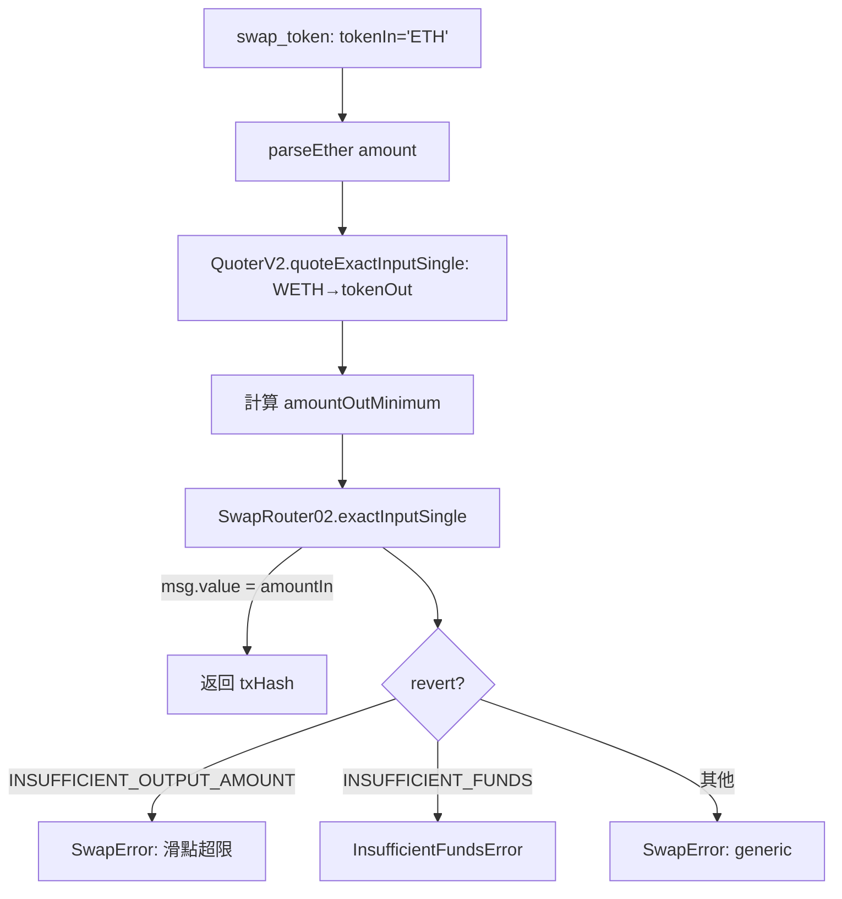
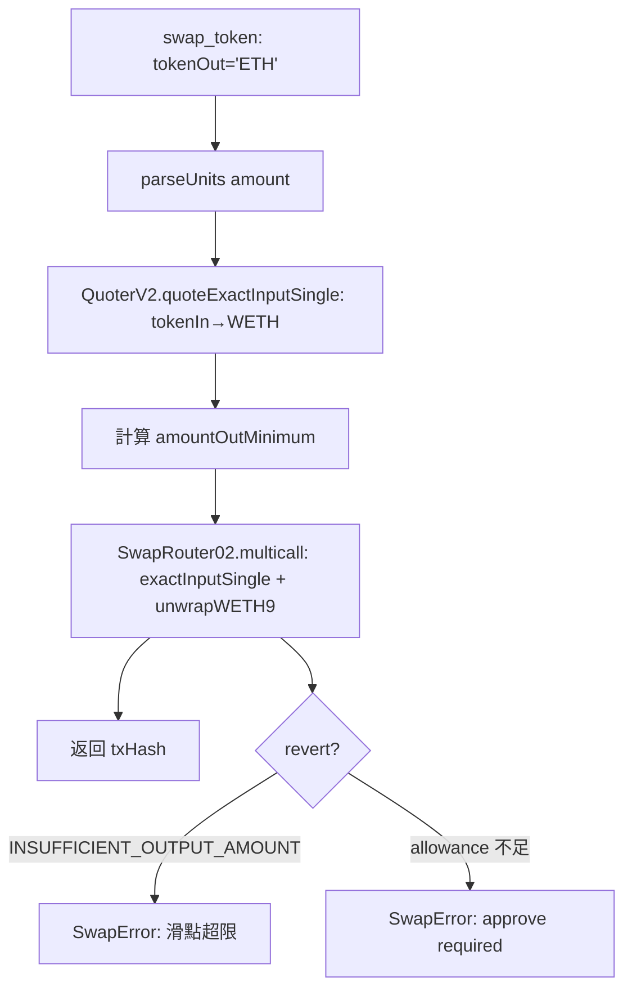
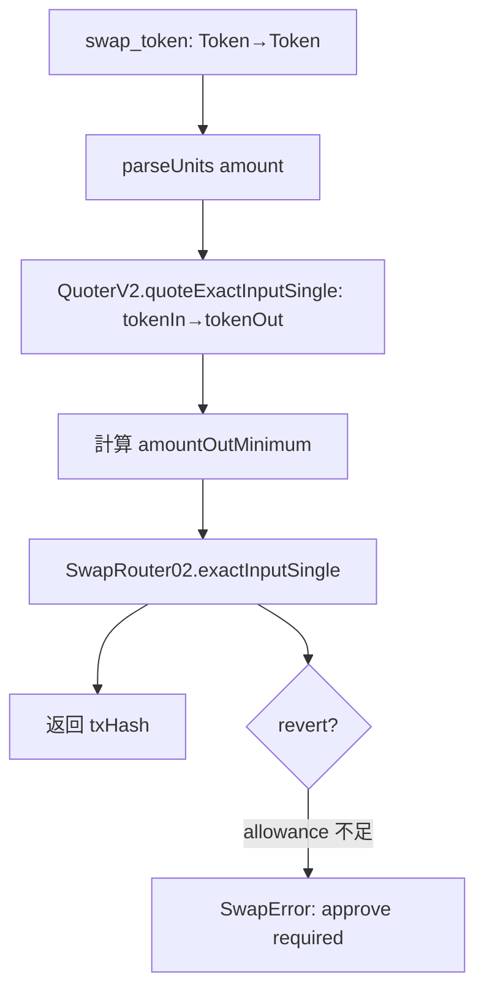

# S0 Brief Spec — swap-token

**版本**: 1.0.0
**日期**: 2026-03-15
**work_type**: new_feature
**spec_mode**: Full Spec

---

## §1 一句話描述

為 openclaw-arbitrum-wallet 新增 `swap_token` tool，透過 Uniswap V3 SwapRouter02 在 Arbitrum One 上執行 token swap（單跳），支援 ETH↔Token 與 Token↔Token。

---

## §2 背景與痛點

- openclaw agent 目前有轉帳、查餘額、approve 等基礎鏈上操作，但無法做幣種轉換
- DeFi swap 是 agent 自主交易的核心能力，沒有 swap 就無法做 portfolio rebalance、套利、或幣種轉換
- Uniswap V3 是 Arbitrum 上流動性最大的 DEX，SwapRouter02 是標準入口

---

## §3 目標與成功標準

**目標**：
- 新增 `swap_token` tool，支援三種 swap 路徑（ETH→Token, Token→ETH, Token→Token）
- 內部自動 quote（透過 Quoter V2 合約），用 `slippageBps` 計算 `amountOutMinimum`
- 遵循現有 handler 模式（`HandlerResult<T>`, `getProvider`, `withRetry`, 不 throw）

**成功標準**：
- [ ] `swap_token` 可處理 ETH→Token swap（帶 msg.value，tokenIn 為 WETH 地址）
- [ ] `swap_token` 可處理 Token→ETH swap（swap 後 unwrapWETH9 取回 ETH）
- [ ] `swap_token` 可處理 Token→Token swap（標準 exactInputSingle）
- [ ] 內部自動 call Quoter V2 取得預期輸出量，依 `slippageBps` 計算 `amountOutMinimum`
- [ ] 參數驗證完整（address 格式、amount > 0、slippageBps 合理範圍）
- [ ] 錯誤分類正確（InvalidKeyError, InsufficientFundsError, SwapError, NetworkError）
- [ ] Jest 單元測試覆蓋三種 swap 路徑 + 所有錯誤路徑
- [ ] npm test 全過，npx tsc --noEmit pass

---

## §4 功能區拆解 (FA Decomposition)

### §4.1 FA 識別表

| FA ID | 名稱 | 一句話描述 | 獨立性 |
|-------|------|-----------|--------|
| FA-1 | swap_token handler | 核心 swap 邏輯：三種路徑、自動 quote、滑點保護 | 主體 |
| FA-2 | Uniswap 常數與 ABI | SwapRouter02/QuoterV2/WETH 地址與 ABI 定義 | 高（純資料） |

**拆解策略**: `single_sop_fa_labeled`

---

### §4.2 核心流程圖

```mermaid
flowchart TD
    A[agent 呼叫 swap_token] --> B{判斷 swap 類型}
    B -->|tokenIn == 'ETH'| C1[ETH→Token 路徑]
    B -->|tokenOut == 'ETH'| C2[Token→ETH 路徑]
    B -->|otherwise| C3[Token→Token 路徑]

    C1 --> Q[呼叫 QuoterV2.quoteExactInputSingle]
    C2 --> Q
    C3 --> Q

    Q --> S[計算 amountOutMinimum = quote * (1 - slippageBps/10000)]

    C1 --> S1[SwapRouter02.exactInputSingle + msg.value]
    C2 --> S2[SwapRouter02.exactInputSingle → unwrapWETH9]
    C3 --> S3[SwapRouter02.exactInputSingle]

    S --> S1
    S --> S2
    S --> S3

    S1 --> R[返回 txHash + amountOut 預估]
    S2 --> R
    S3 --> R
```

---

### §4.3 ETH→Token 流程



---

### §4.4 Token→ETH 流程



---

### §4.5 Token→Token 流程



---

## §5 技術設計要點

### Uniswap V3 合約（Arbitrum One）

| 合約 | 用途 | 地址 |
|------|------|------|
| SwapRouter02 | 執行 swap | `0x68b3465833fb72A70ecDF485E0e4C7bD8665Fc45` |
| QuoterV2 | 報價（view call） | `0x61fFE014bA17989E743c5F6cB21bF9697530B21e` |
| WETH | Wrapped ETH | `0x82aF49447D8a07e3bd95BD0d56f35241523fBab1` |

### 參數設計

```typescript
interface SwapTokenParams {
  privateKey: string;       // 0x-prefixed
  tokenIn: string;          // token address 或 'ETH'
  tokenOut: string;         // token address 或 'ETH'
  amountIn: string;         // human-readable (e.g. '0.1')
  fee?: number;             // pool fee tier: 100, 500, 3000, 10000. default: 3000
  slippageBps?: number;     // basis points, default: 50 (0.5%)
  deadline?: number;        // unix timestamp, default: now + 1800 (30min)
  rpcUrl?: string;          // optional custom RPC
}
```

### 回傳設計

```typescript
interface SwapTokenData {
  txHash: string;
  tokenIn: string;
  tokenOut: string;
  amountIn: string;
  expectedAmountOut: string; // from quoter
  amountOutMinimum: string;  // after slippage
  fee: number;
  path: string;             // 'ETH→TOKEN' | 'TOKEN→ETH' | 'TOKEN→TOKEN'
}
```

---

## §6 技術棧

| 項目 | 選擇 | 理由 |
|------|------|------|
| Swap Router | Uniswap V3 SwapRouter02 | Arbitrum 上標準 Uniswap 入口 |
| Quoter | QuoterV2 | View call，不消耗 gas，取得精確報價 |
| ABI 來源 | 手動定義最小 ABI | 只需要 exactInputSingle, multicall, unwrapWETH9, quoteExactInputSingle |

---

## §7 例外情境（六維度）

| # | 維度 | 情境 | 處理方式 | FA |
|---|------|------|---------|-----|
| E1 | 並行/競爭 | 重複觸發 swap，nonce 衝突 | 不管，fire-and-forget，跟 sendTransaction 一致 | FA-1 |
| E2 | 狀態轉換 | approve 未 confirm 就 swap | 不自動 approve，agent 責任；router revert 時返回 SwapError | FA-1 |
| E3 | 資料邊界 | amountIn=0、slippageBps=10001（>100%）、fee 不在 100/500/3000/10000 | 參數驗證層攔截，ValidationError | FA-1 |
| E4 | 資料邊界 | tokenIn == tokenOut | ValidationError: cannot swap token to itself | FA-1 |
| E5 | 網路/外部 | QuoterV2 call 失敗、RPC timeout | withRetry 處理 RPC，quote 失敗返回 SwapError | FA-1 |
| E6 | 業務邏輯 | tokenIn 餘額不足 | router revert → InsufficientFundsError | FA-1 |
| E7 | 業務邏輯 | 指定 fee tier 的 pool 不存在 | QuoterV2 revert → SwapError: pool not found | FA-1 |
| E8 | 業務邏輯 | price impact 過大、滑點超限 | router revert INSUFFICIENT_OUTPUT_AMOUNT → SwapError | FA-1 |
| E9 | 資料邊界 | deadline 已過期（< now） | ValidationError: deadline already expired | FA-1 |
| E10 | 資料邊界 | tokenIn='ETH' 且 tokenOut='ETH' | ValidationError: cannot swap ETH to ETH | FA-1 |

---

## §8 範圍

**In Scope**：
- `swap_token` handler 實作（三種路徑）
- 內部自動 QuoterV2 quote + slippage 計算
- Uniswap V3 常數/ABI 定義（`src/uniswap.ts`）
- 型別定義（SwapTokenParams, SwapTokenData）
- Jest 單元測試（mock 所有合約互動）
- 註冊到 skill manifest（index.ts）
- README 更新

**Out of Scope**：
- 多跳路由（exactInput）
- 自動 approve（agent 分步操作）
- 獨立 quote tool（內建在 swap 中）
- Limit order
- 流動性提供（add/remove liquidity）
- 其他 DEX（SushiSwap, Camelot 等）

---

## §9 約束

- 不新增 runtime dependencies（ethers v6 已能處理合約互動）
- 遵循現有 handler 模式（HandlerResult, getProvider, withRetry, classifyKeyError, isNetworkError）
- fire-and-forget（返回 txHash，不等鏈上確認）
- Token→ETH 路徑需要 multicall（exactInputSingle + unwrapWETH9），這是唯一需要 multicall 的路徑
